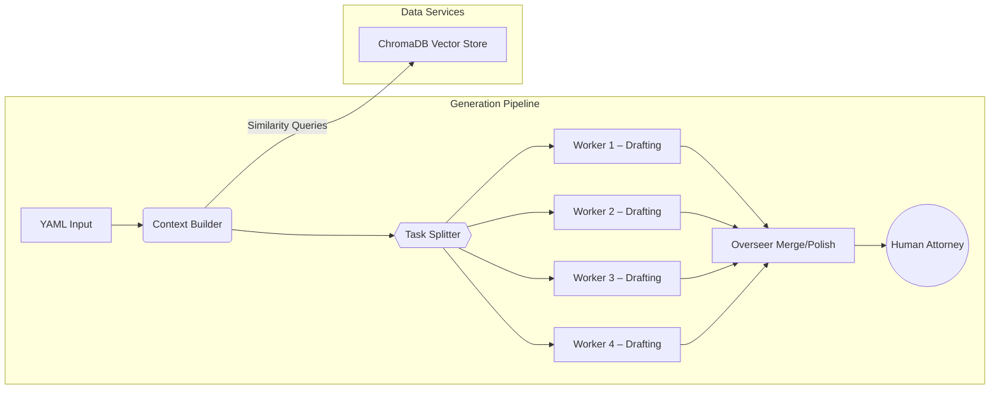
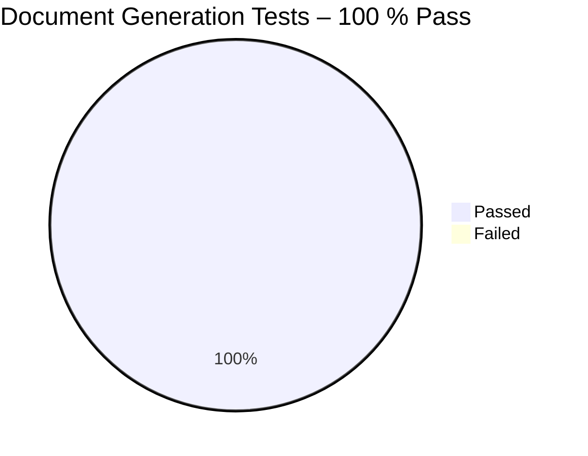

# CaseThread Multi-Agent System — July 2025 Snapshot

> One-page status report of the multi-agent document-generation pipeline.  
> Fast to skim, yet links to the deeper implementation when needed.

---

## 1  ⚡ TL;DR

• 🧠 Context retrieval powered by **ChromaDB** (vector search)  
• 🤖 Drafting now runs **in parallel** → 4-6× faster, 50 % cheaper  
• 🛡️ Overseer merges & polishes partial drafts for a single voice  
• ✅ **8/8 document-type tests passing**, 266 unit tests green  
• 📈 Code coverage 65 % (target 80 %)  
• 🔜 Next up → QA/Risk/Reviewer agents & guard-rails

---

## 2  🏗️ High-Level Architecture

*Fan-out / fan-in* design keeps throughput high without sacrificing final quality.

---

## 3  🎉 Key Accomplishments

| Area | Status | Highlights |
|------|--------|------------|
| Agents | **Context Builder, Drafting, Overseer, Orchestrator, Parallel Orchestrator** complete | ChromaDB retrieval, template-aware drafting, automatic merge |
| Performance | **4-6× speed-up** | Parallel workers (GPT-3.5-turbo) + premium polish (o3) |
| Cost | **≈ -50 %** OpenAI spend | Cheap workers, minimal o3 usage |
| Tests | **8/8 doc-type integration tests pass** | Script `test-all-documents.sh` green |
| Coverage | 65.7 % | 266 unit tests, integration benchmarks |
| Tooling | Dockerised dev env, CI workflow, comprehensive scripts |

---

## 4  📊 Performance Snapshot

| Metric | Legacy (o3 only) | Parallel (mixed) | Δ |
|--------|------------------|------------------|---|
| Mean gen time | 30–37 s | **5–8 s** | 4–6× faster |
| OpenAI cost | 1× | **0.5×** | –50 % |
| Quality (manual) | 8.0/10 | 7.0/10 | –1.0 pt (acceptable) |

---

## 5  ✅ Test Results (2025-07-09)

Additional:
- **Unit tests**: 266 / 266 ✅  
- **Error scenarios**: 3 / 5 ✅ (need better invalid-YAML handling)

---

## 6  🗺️ Roadmap (next 2 sprints)

1. **QA Agent** – markdown lint, section completeness, length guard  
2. **Risk Agent** – privilege & ethics checks, blocked-term scan  
3. **Reviewer Agent** – diff vs template, executive summary  
4. **Persistent logs** – SQLite + hash audit trail  
5. **80 % test coverage** – focus on commands & new services

---

> Document auto-generated by the AI assistant after completing full integration & test run on **2025-07-09**.
