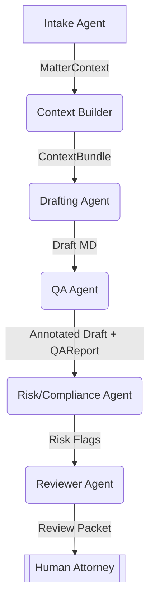

# CaseThread Multi-Agent Architecture Blueprint

> This document defines the **first iteration** of the multi-agent system that will power CaseThread.  It is the single source of truth for how independent agents collaborate, where guard-rails are enforced, and how the pipeline is continuously tested.  Keep this file up-to-date as the design evolves.

---

## 1. Objectives

1. Speed up drafting of IP documents while **preserving attorney control & liability boundaries**.
2. Provide **explainable, audit-ready** steps for every AI action.
3. Maintain **local-first privacy** (no client data is stored off-device unless explicitly configured).
4. Integrate seamlessly with the existing CLI (`generate`, `learn`, future `review`) and Jest test-suite.

---

## 2. Agent Roles & Responsibilities

| # | Agent | Key Responsibilities | Primary Inputs | Primary Outputs |
|---|--------|----------------------|----------------|-----------------|
| 1 | **Intake Agent** | • Validate YAML / JSON input • Ask follow-up questions (CLI prompt TBD) • Normalize data types | `*.yaml` matter file | Normalised `MatterContext` object or validation errors |
| 2 | **Context Builder Agent** | • Query vector DB of firm precedents, USPTO/TTAB/PatentsView datasets • Return ranked snippets with citations | `MatterContext` | `ContextBundle` (embeddings + sources) |
| 3 | **Drafting Agent** | • Section-by-section generation using template metadata • Streams tokens back for live UX | Template JSON + `ContextBundle` | Raw markdown draft, streaming chunks |
| 4 | **QA Agent** | • Lints markdown: headings, placeholder checks, length limits • Validates required sections & fields | Draft markdown | Annotated markdown + `QAReport` |
| 5 | **Risk / Compliance Agent** | • Detects ethics conflicts, privilege leaks, export-control triggers • Flags prohibited language | Annotated markdown | Risk flags, recommended redactions |
| 6 | **Reviewer Agent** | • Creates diff vs. template • Generates executive summary & billable-time memo | Final markdown, `QAReport`, Risk flags | Review packet for attorney |

> **Note:** Agents 3-6 can be iterative; e.g. QA may request the Drafting agent to regenerate a section.

---

## 3. Pipeline Flow

Each edge represents a **checkpoint** where automated tests assert the success criteria below.

---

## 4. Checkpoints & Guard-Rails

| Checkpoint | Automated Guard-Rails (fail pipeline if any are violated) |
|------------|-----------------------------------------------------------|
| After **Intake** | • YAML matches JSON-Schema • All `requiredFields` from template present |
| After **Context Builder** | • ≥ 3 high-similarity snippets (cos-sim > 0.75) • Total context < 4k tokens |
| During **Drafting** | • Streaming response heartbeat ≤ 5 s • Placeholder pattern `{{.*}}` not present in final chunk |
| After **QA** | • Markdown linter passes (`heading-increment`, `no-duplicate-headings`) • Required sections found • Document length between 50 and 60 000 characters |
| After **Risk** | • No blocked terms (`\bconfidentiality waiver\b`, etc.) • Privilege keywords balanced (`privileged`, `without prejudice`) |
| Before **Review Handoff** | • All previous reports stored in `agent_logs` table • SHA-256 hash of final draft recorded |

Guard-rails will live in `src/guards/` and be imported by both the orchestrator and the Jest test-suite.

---

## 5. Integration Points

1. **Orchestrator** – `src/agents/Orchestrator.ts` (to be created) orchestrates the above agents and exposes a single async `runJob()` used by the CLI.
2. **CLI Update** – `generate` command replaces direct `OpenAIService` call with `await orchestrator.runJob(jobConfig)`.
3. **Vector Store** – `services/retriever.ts` wraps Chroma/FAISS with local sqlite persistence (`./.ct_vector/`).
4. **Agent Logs** – SQLite table `agent_logs` with columns `(id, agent, input_hash, output_hash, timestamp, metadata)`.
5. **Tests** – Extend `__tests__/` with:
   * `orchestrator.integration.test.ts` – end-to-end happy-path.
   * `guards/*.test.ts` – unit tests for each guard.

---

## 6. Development Checkpoints (Sprint 1)

| ID | Task | Owner | Status |
|----|------|-------|--------|
| T-01 | Scaffold `Orchestrator` with Intake → Drafting flow |  | ☐ |
| T-02 | Implement `IntakeGuard` & Jest tests |  | ☐ |
| T-03 | Add `services/retriever.ts` with Chroma & embedder |  | ☐ |
| T-04 | Replace `generate` command logic with orchestrator |  | ☐ |
| T-05 | Write integration test for pipeline happy-path |  | ☐ |

> Update this table each sprint.  Use task IDs in commit messages (`feat(T-03): …`).

---

## 7. Future Extensions

* Parallel agent execution with AutoGen group-chat.
* GUI visual diff component (Phase 2).
* Batch generation & docket syncing.
* API layer for SaaS deployment (if privacy hurdles cleared).

---

_Last updated: {{DATE}}_
