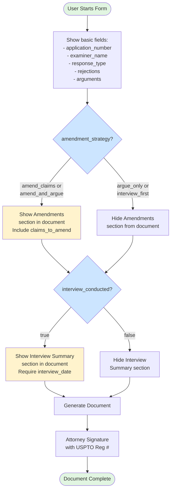

# Office Action Response - Conditional Logic

## Visual Diagram

## Text Description for AI Agents

### Template: office-action-response
**Trigger Fields**: 2 fields controlling document sections
**Conditional Sections**: 2 document sections (not fields)

### Decision Points:
1. **amendment_strategy** (select)
   - Options: amend_claims, argue_only, amend_and_argue, interview_first
   - If "amend_claims" OR "amend_and_argue": Show Amendments section
   - If "argue_only" OR "interview_first": Hide Amendments section
   - Controls: Document section, not a field

2. **interview_conducted** (boolean)
   - If true: Show Interview Summary section
   - If true: Make interview_date field visible and required
   - If false: Hide Interview Summary section and interview_date field

### Form Flow:
1. **Initial State**: Basic fields visible, conditional sections hidden
2. **First Decision**: User selects amendment_strategy
3. **Second Decision**: User indicates if interview was conducted
4. **Document Generation**: Include/exclude sections based on choices

### Field vs Section Conditional:
- `claims_to_amend` field is always visible (optional)
- The Amendments SECTION only appears if strategy includes amendments
- `interview_date` field only visible if interview_conducted = true

### Implementation Notes:
- Two independent conditionals
- Sections are conditionally included in document
- Different from simple field show/hide
- Remember interview_date is a dependent field 