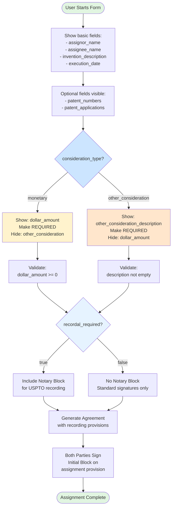

# Patent Assignment Agreement - Conditional Logic

## Visual Diagram

## Text Description for AI Agents

### Template: patent-assignment-agreement
**Primary Trigger**: `consideration_type` (select: "monetary" or "other_consideration")
**Secondary Trigger**: `recordal_required` (boolean)
**Conditional Fields**: `dollar_amount` OR `other_consideration_description`

### Form Flow:
1. **Initial State**: Basic fields visible, consideration fields hidden
2. **Decision Point 1**: User selects consideration_type
3. **If "MONETARY" Selected**:
   - Show `dollar_amount` field (REQUIRED)
   - Hide `other_consideration_description`
   - Validate dollar_amount >= 0
4. **If "OTHER_CONSIDERATION" Selected**:
   - Show `other_consideration_description` field (REQUIRED)
   - Hide `dollar_amount`
   - Validate description not empty
5. **Decision Point 2**: User selects recordal_required
6. **If RECORDAL Required (true)**:
   - Include notary block in document
   - Add recording-specific language
7. **If NO RECORDAL (false)**:
   - Standard signatures only
   - Simpler document format

### Validation Rules:
- Only ONE consideration field visible at a time
- dollar_amount must be >= 0 (when visible)
- Clear hidden field when switching types

### Document Features:
- Initial block for assignment acknowledgment
- Both parties must sign
- Optional notary block based on recordal needs

### Implementation Notes:
- Radio buttons or select for consideration_type
- Show currency symbol with dollar_amount field
- Consider placeholder text for other_consideration
- Notary block adds significant length to document 