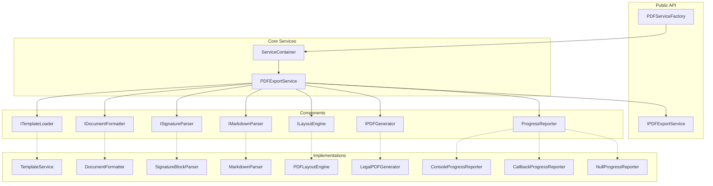
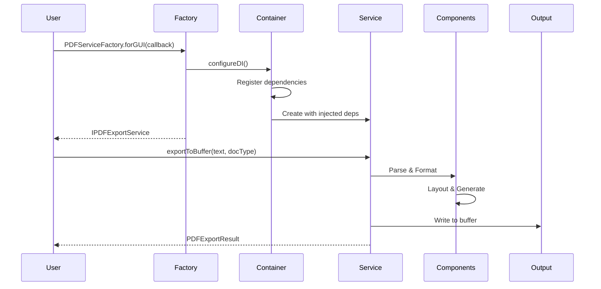
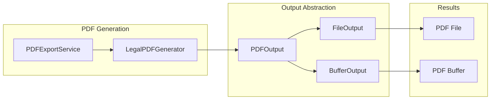
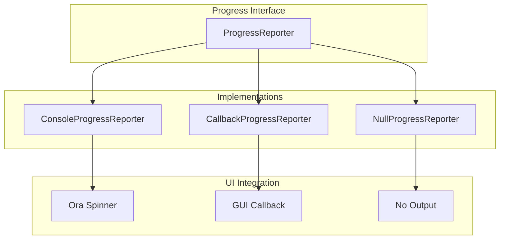
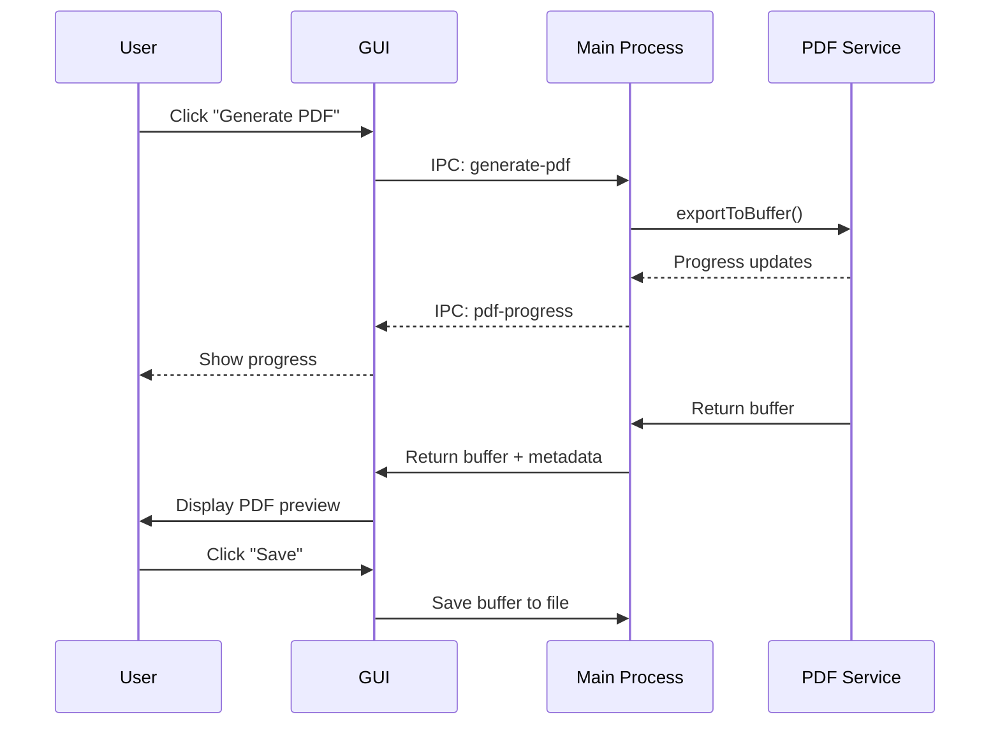

# PDF Service Architecture

## Overview

The CaseThread PDF Service is a modular, extensible system for generating legal documents in PDF format. The architecture emphasizes separation of concerns, dependency injection, and environment-specific optimizations.

## Architecture Principles

1. **Modularity**: Each component has a single responsibility
2. **Testability**: All dependencies are injectable
3. **Flexibility**: Different implementations for different environments
4. **Backward Compatibility**: Existing code continues to work
5. **Performance**: Optimized for each use case (CLI, GUI, Testing)

## Component Architecture



## Data Flow



## Component Details

### PDFServiceFactory

The main entry point for creating PDF services.

```typescript
class PDFServiceFactory {
  static forCLI(): IPDFExportService
  static forGUI(onProgress: ProgressCallback): IPDFExportService
  static forTesting(config?: ServiceConfiguration): IPDFExportService
}
```

**Responsibilities:**
- Creates pre-configured services for different environments
- Manages ServiceContainer setup
- Provides simple API for common use cases

### ServiceContainer

Manages dependency injection and service lifecycle.

```typescript
class ServiceContainer {
  register<T>(name: string, factory: () => T, singleton?: boolean): void
  get<T>(name: string): T
  static configureCLI(): ServiceContainer
  static configureGUI(onProgress: ProgressCallback): ServiceContainer
  static configureTesting(): ServiceContainer
}
```

**Responsibilities:**
- Service registration and instantiation
- Singleton management
- Environment-specific configuration

### PDFExportService

The core service that orchestrates PDF generation.

```typescript
class PDFExportService implements IPDFExportService {
  constructor(
    formatter?: IDocumentFormatter,
    parser?: ISignatureParser,
    markdown?: IMarkdownParser,
    layoutFactory?: LayoutEngineFactory,
    generatorFactory?: PDFGeneratorFactory,
    progress?: ProgressReporter,
    logger?: Logger
  )
}
```

**Responsibilities:**
- Coordinates all components
- Manages generation workflow
- Reports progress
- Handles errors

## Interface Hierarchy

```mermaid
classDiagram
    class IPDFExportService {
        <<interface>>
        +export(text, path, type, options?)
        +exportToBuffer(text, type, options?)
    }
    
    class ITemplateLoader {
        <<interface>>
        +loadTemplate(type)
        +loadExplanation(type)
        +listTemplates()
    }
    
    class IDocumentFormatter {
        <<interface>>
        +getFormattingRules(type)
        +applyLineSpacing(type, isSignature)
        +calculateLineHeight(size, spacing)
        +getMarginsForPage(type, page)
    }
    
    class ISignatureParser {
        <<interface>>
        +parseDocument(text)
    }
    
    class IMarkdownParser {
        <<interface>>
        +parseHeading(line)
        +parseInlineFormatting(text)
        +isHorizontalRule(line)
        +parseListItem(line)
    }
    
    class ILayoutEngine {
        <<interface>>
        +layoutDocument(blocks, type)
    }
    
    class IPDFGenerator {
        <<interface>>
        +start()
        +finalize()
        +writeText(text, options)
        +writeParagraph(text, options)
        +writeHeading(text, level, options)
        +newPage()
    }
    
    class ProgressReporter {
        <<interface>>
        +report(step, detail)
        +start(taskName)
        +complete()
        +fail(error)
    }
```



## Output Architecture



## Progress Reporting Architecture



## Factory Pattern Benefits

1. **Encapsulation**: Hides complex setup from users
2. **Consistency**: Ensures proper configuration
3. **Optimization**: Environment-specific settings
4. **Simplicity**: One-line service creation

```typescript
// Complex setup hidden
const service = PDFServiceFactory.forCLI();

// Instead of manual configuration
const service = new PDFExportService(
  new DocumentFormatter(),
  new SignatureBlockParser(),
  new MarkdownParser(),
  (gen, fmt, par) => new PDFLayoutEngine(gen, fmt, par),
  (out, opt) => new LegalPDFGenerator(out, opt),
  new ConsoleProgressReporter()
);
```

## Dependency Injection Benefits

### Before (Tight Coupling)
```typescript
class PDFExportService {
  constructor() {
    this.formatter = new DocumentFormatter();
    this.parser = new SignatureBlockParser();
    // Hard to test, can't mock
  }
}
```

### After (Loose Coupling)
```typescript
class PDFExportService {
  constructor(
    formatter: IDocumentFormatter,
    parser: ISignatureParser
  ) {
    this.formatter = formatter;
    this.parser = parser;
    // Easy to test, inject mocks
  }
}
```

## Environment-Specific Optimizations

### CLI Environment
- Console progress with ora spinners
- File output optimization
- Colored console output
- Error stack traces

### GUI Environment
- Callback-based progress
- Buffer output for display
- User-friendly error messages
- Detailed progress events

### Testing Environment
- Silent progress reporting
- Mock-friendly setup
- Deterministic behavior
- Fast execution

## Extension Points

The architecture provides several extension points:

1. **Custom Progress Reporters**: Implement `ProgressReporter`
2. **Custom Formatters**: Implement `IDocumentFormatter`
3. **Custom Parsers**: Implement `ISignatureParser`
4. **Custom Generators**: Implement `IPDFGenerator`
5. **Custom Output Targets**: Implement `PDFOutput`

Example custom implementation:

```typescript
class CloudStorageOutput implements PDFOutput {
  async write(chunk: Buffer): Promise<void> {
    await this.uploadChunk(chunk);
  }
  
  async end(): Promise<void> {
    await this.finalizeUpload();
  }
  
  getType(): 'cloud' {
    return 'cloud';
  }
}
```

## Performance Considerations

1. **Service Reuse**: Services are stateless and can be reused
2. **Lazy Loading**: Components created only when needed
3. **Singleton Pattern**: Shared instances for heavy components
4. **Buffer Efficiency**: Direct memory operations for GUI

## Security Considerations

1. **Input Validation**: All inputs validated before processing
2. **Path Sanitization**: File paths checked for security
3. **Memory Limits**: Buffer size limits enforced
4. **Error Handling**: Sensitive data not exposed in errors

## GUI Integration Architecture

### Electron IPC Communication

The PDF service integrates with the Electron GUI through IPC handlers:

```typescript
// Main process handler
ipcMain.handle('generate-pdf', async (event, { text, documentType }) => {
  const progressReporter = new CallbackProgressReporter((step, detail) => {
    event.sender.send('pdf-progress', { step, detail });
  });
  
  const service = PDFServiceFactory.forGUI(progressReporter);
  const result = await service.exportToBuffer(text, documentType);
  
  return {
    buffer: result.buffer,
    metadata: result.metadata
  };
});

// Renderer process usage
const { buffer, metadata } = await window.api.generatePDF({
  text: documentContent,
  documentType: selectedType
});
```

### Buffer-Based Preview Workflow

The GUI uses buffer generation for preview-before-save:



### Progress Reporting Integration

The service integrates with the BackgroundGenerationStatus component:

```typescript
// GUI component integration
const PDFGenerator = () => {
  const [progress, setProgress] = useState<ProgressState>();
  
  const generatePDF = async () => {
    // Subscribe to progress updates
    window.api.onPDFProgress((step, detail) => {
      setProgress({ step, detail, percentage: calculatePercentage(step) });
    });
    
    const result = await window.api.generatePDF({
      text: document.content,
      documentType: document.type
    });
    
    // Display in viewer
    displayPDF(result.buffer);
  };
  
  return (
    <>
      <BackgroundGenerationStatus progress={progress} />
      <Button onClick={generatePDF}>Generate PDF</Button>
    </>
  );
};
```

### Memory Management

Buffer handling for large documents:

```typescript
// Efficient buffer transfer
const optimizedHandler = async (event, options) => {
  const result = await service.exportToBuffer(options.text, options.documentType);
  
  // Transfer buffer efficiently
  const arrayBuffer = result.buffer.buffer.slice(
    result.buffer.byteOffset,
    result.buffer.byteOffset + result.buffer.byteLength
  );
  
  return {
    buffer: new Uint8Array(arrayBuffer),
    metadata: result.metadata
  };
};
```

### Error Handling in GUI Context

User-friendly error display:

```typescript
// Main process error handling
ipcMain.handle('generate-pdf', async (event, options) => {
  try {
    return await generatePDF(options);
  } catch (error) {
    // Log detailed error
    logger.error('PDF generation failed', error);
    
    // Return user-friendly error
    return {
      error: {
        message: getUserFriendlyMessage(error),
        code: error.code || 'PDF_GENERATION_FAILED'
      }
    };
  }
});
```

## Future Architecture Enhancements

1. **Plugin System**: Dynamic component loading
2. **Streaming Output**: For very large documents
3. **Worker Threads**: Parallel PDF generation
4. **Cloud Integration**: Direct cloud storage output
5. **Template Caching**: Performance optimization

## Summary

The PDF Service architecture provides:

- **Modularity** through clear interfaces
- **Flexibility** via dependency injection
- **Optimization** for different environments
- **Extensibility** through multiple extension points
- **Maintainability** with separation of concerns

This architecture enables the service to adapt to various use cases while maintaining a simple, consistent API for users. 