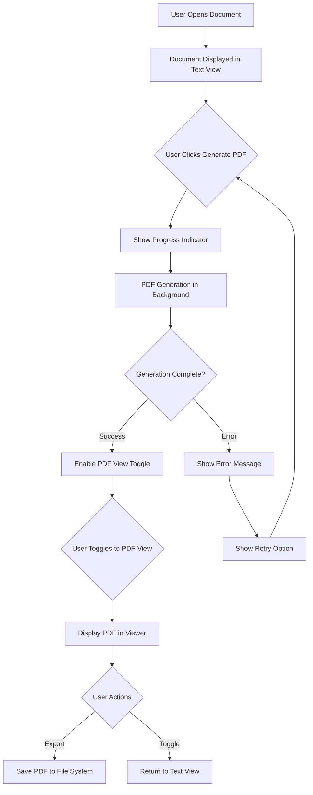

# PDF Features UI/UX Mockups

## Overview
This document contains comprehensive UI/UX mockups for integrating PDF generation and viewing capabilities into the CaseThread Electron GUI application. These mockups build upon the existing EnhancedDocumentViewer component and Developer G's recent UI enhancements.

## User Flow



## Toolbar Design

### Current Toolbar (Text View Only)
```
┌─────────────────────────────────────────────────────────────────────┐
│ [←] [→] [⟲]  │  patent-assignment.md  │              [AI] [💾] [⚙️] │
└─────────────────────────────────────────────────────────────────────┘
```

### Enhanced Toolbar with PDF Features
```
┌─────────────────────────────────────────────────────────────────────┐
│ [←] [→] [⟲]  │  patent-assignment.md  │  [Text] [📄 PDF] [⬇] [AI] [💾] [⚙️] │
└─────────────────────────────────────────────────────────────────────┘

Legend:
[←] [→] - Navigation buttons (existing)
[⟲] - Refresh button (existing)
[Text] - View mode indicator/toggle
[📄 PDF] - Generate PDF button
[⬇] - Export PDF button (disabled until PDF generated)
[AI] - AI Assistant (existing)
[💾] - Save (existing)
[⚙️] - Settings (existing)
```

### Button States

#### Generate PDF Button
- **Default**: Blue background, white PDF icon, "Generate PDF" tooltip
- **Hover**: Darker blue, cursor pointer
- **Active**: Shows loading spinner
- **Disabled**: Gray when processing
- **Success**: Brief green checkmark animation

#### View Toggle
- **Text Mode**: "Text" highlighted, PDF dimmed
- **PDF Mode**: "PDF" highlighted, Text dimmed
- **Disabled**: Both dimmed when no PDF available

#### Export Button
- **Enabled**: Active when PDF is generated
- **Disabled**: Gray when no PDF available
- **Hover**: Shows "Export PDF" tooltip

## View Layouts

### Text View (Default/Current)
```
┌─────────────────────────────────────────────────────────────────────┐
│                         Enhanced Toolbar                             │
├─────────────────────────────────────────────────────────────────────┤
│                                                                     │
│  # Patent Assignment Agreement                                      │
│                                                                     │
│  **PARTIES**                                                       │
│                                                                     │
│  This Patent Assignment Agreement ("Agreement") is entered into     │
│  as of January 15, 2024, by and between:                          │
│                                                                     │
│  **Assignor:** TechFlow Solutions Inc.                            │
│  123 Innovation Drive, San Francisco, CA 94105                     │
│                                                                     │
│  **Assignee:** MegaCorp Technologies LLC                          │
│  456 Enterprise Way, New York, NY 10001                           │
│                                                                     │
│  [Markdown content continues...]                                   │
│                                                                     │
└─────────────────────────────────────────────────────────────────────┘
```

### PDF View
```
┌─────────────────────────────────────────────────────────────────────┐
│                         Enhanced Toolbar                             │
├─────────────────────────────────────────────────────────────────────┤
│  ┌───────────────────────────────────────────────────────────────┐ │
│  │                                                               │ │
│  │                    PATENT ASSIGNMENT AGREEMENT                │ │
│  │                                                               │ │
│  │  PARTIES                                                      │ │
│  │                                                               │ │
│  │  This Patent Assignment Agreement ("Agreement") is entered    │ │
│  │  into as of January 15, 2024, by and between:               │ │
│  │                                                               │ │
│  │  Assignor: TechFlow Solutions Inc.                          │ │
│  │  123 Innovation Drive                                        │ │
│  │  San Francisco, CA 94105                                     │ │
│  │                                                               │ │
│  │  Assignee: MegaCorp Technologies LLC                        │ │
│  │  456 Enterprise Way                                          │ │
│  │  New York, NY 10001                                          │ │
│  │                                                               │ │
│  └───────────────────────────────────────────────────────────────┘ │
│  ┌───────────────────────────────────────────────────────────────┐ │
│  │ Page 1 of 5    [◀] [▶]    Zoom: [100% ▼]    [🔍+] [🔍-]    │ │
│  └───────────────────────────────────────────────────────────────┘ │
└─────────────────────────────────────────────────────────────────────┘
```

### Split View (Future Enhancement)
```
┌─────────────────────────────────────────────────────────────────────┐
│                         Enhanced Toolbar                             │
├─────────────────────────────────────────────────────────────────────┤
│         Text View          │ │         PDF Preview                 │
│                           │ │                                     │
│  # Patent Assignment      │ │  PATENT ASSIGNMENT AGREEMENT       │
│                           │ │                                     │
│  **PARTIES**             │ │  PARTIES                           │
│                           │ │                                     │
│  This Patent Assignment   │ │  This Patent Assignment Agreement  │
│  Agreement ("Agreement")  │ │  ("Agreement") is entered into     │
│  is entered into as of    │ │  as of January 15, 2024, by and   │
│  January 15, 2024...      │ │  between:                          │
│                           │ │                                     │
└─────────────────────────────────────────────────────────────────────┘
```

## Progress States

### PDF Generation Progress
```
┌─────────────────────────────────────────────────────────────────────┐
│ Generating PDF for patent-assignment.md                             │
│ ████████████░░░░░░░░ 60% - Processing signature blocks             │
│                                                                     │
│ Steps completed:                                                    │
│ ✓ Parsing document structure                                        │
│ ✓ Extracting metadata                                               │
│ ➤ Processing signature blocks                                       │
│ ○ Generating PDF layout                                             │
│ ○ Finalizing document                                               │
└─────────────────────────────────────────────────────────────────────┘
```

### Inline Progress (Toolbar)
```
┌─────────────────────────────────────────────────────────────────────┐
│ [←] [→] [⟲] │ patent-assignment.md │ [⊙ Generating PDF...] [AI] [💾] [⚙️] │
└─────────────────────────────────────────────────────────────────────┘
```

## Error States

### Generation Error
```
┌─────────────────────────────────────────────────────────────────────┐
│ ⚠️ PDF Generation Failed                                            │
│                                                                     │
│ Unable to generate PDF: Invalid signature block format              │
│                                                                     │
│ [View Details] [Retry] [Cancel]                                     │
└─────────────────────────────────────────────────────────────────────┐
```

### Network Error (for future API integration)
```
┌─────────────────────────────────────────────────────────────────────┐
│ ⚠️ Connection Error                                                 │
│                                                                     │
│ Unable to connect to PDF service. Please check your connection.     │
│                                                                     │
│ [Retry] [Work Offline] [Cancel]                                     │
└─────────────────────────────────────────────────────────────────────┐
```

## Success States

### Generation Complete
```
┌─────────────────────────────────────────────────────────────────────┐
│ ✅ PDF generated successfully!                                       │
│ Click the PDF button to view or the export button to save.          │
└─────────────────────────────────────────────────────────────────────┘
```

### Export Success
```
┌─────────────────────────────────────────────────────────────────────┐
│ ✅ PDF exported successfully!                                        │
│ Saved to: ~/Documents/CaseThread/patent-assignment-2024-01-15.pdf   │
│ [Open File] [Open Folder] [OK]                                      │
└─────────────────────────────────────────────────────────────────────┘
```

## Interaction Specifications

### Button Behaviors

#### Generate PDF Button
```typescript
// Click behavior
onClick: 
  - Disable button
  - Show progress indicator
  - Trigger PDF generation via IPC
  - On success: Enable view toggle, show success toast
  - On error: Show error dialog, re-enable button

// Hover behavior
onHover:
  - Show tooltip: "Generate PDF"
  - Lighten button color
  - Cursor: pointer
```

#### View Mode Toggle
```typescript
// Toggle behavior
onChange:
  - If PDF not generated: Show tooltip "Generate PDF first"
  - If PDF available: Switch view smoothly
  - Maintain scroll position when possible
  - Update toggle visual state

// Keyboard shortcut: Ctrl+Shift+P (toggle between views)
```

#### Export Button
```typescript
// Click behavior
onClick:
  - If no PDF: Show tooltip "Generate PDF first"
  - If PDF ready: Open save dialog
  - Default filename: [document-name]-[YYYY-MM-DD].pdf
  - On save: Show success notification
  - On cancel: No action

// Keyboard shortcut: Ctrl+Shift+E (export)
```

## Animation Specifications

### View Transitions
```css
/* Smooth fade transition between text and PDF views */
.view-transition {
  transition: opacity 0.3s ease-in-out;
}

/* Slide-in for PDF view */
.pdf-view-enter {
  transform: translateX(100%);
  opacity: 0;
}
.pdf-view-enter-active {
  transform: translateX(0);
  opacity: 1;
  transition: all 0.3s ease-out;
}
```

### Progress Animations
```css
/* Smooth progress bar fill */
.progress-fill {
  transition: width 0.5s ease-out;
}

/* Pulsing for active step */
@keyframes pulse {
  0%, 100% { opacity: 1; }
  50% { opacity: 0.7; }
}
.active-step {
  animation: pulse 1.5s infinite;
}
```

### Button States
```css
/* Hover effects */
.pdf-button:hover {
  transform: translateY(-1px);
  box-shadow: 0 2px 4px rgba(0,0,0,0.1);
  transition: all 0.2s ease;
}

/* Active/clicking */
.pdf-button:active {
  transform: translateY(0);
  box-shadow: none;
}
```

## Design Tokens

```css
:root {
  /* Colors */
  --pdf-primary: #0066cc;
  --pdf-primary-hover: #0052a3;
  --pdf-primary-active: #004080;
  --pdf-success: #00a854;
  --pdf-error: #e74c3c;
  --pdf-warning: #f39c12;
  --pdf-disabled: #cccccc;
  
  /* Progress */
  --pdf-progress-bg: #f0f0f0;
  --pdf-progress-fill: var(--pdf-primary);
  --pdf-progress-text: #666666;
  
  /* Spacing */
  --pdf-button-padding: 8px 16px;
  --pdf-toolbar-gap: 12px;
  --pdf-view-padding: 20px;
  
  /* Animations */
  --pdf-transition-duration: 0.3s;
  --pdf-transition-easing: ease-in-out;
  
  /* Typography */
  --pdf-button-font-size: 14px;
  --pdf-tooltip-font-size: 12px;
}
```

## Accessibility Considerations

### Keyboard Navigation
- Tab order: Navigation → Document selector → View toggle → Generate PDF → Export → AI → Save → Settings
- Enter/Space activates buttons
- Escape closes dialogs
- Arrow keys navigate PDF pages

### Screen Reader Support
```html
<!-- Generate PDF button -->
<button 
  aria-label="Generate PDF document"
  aria-pressed="false"
  aria-busy="true" <!-- when generating -->
>
  <span aria-hidden="true">📄</span>
  <span class="sr-only">Generate PDF</span>
</button>

<!-- Progress -->
<div role="progressbar" 
     aria-valuenow="60" 
     aria-valuemin="0" 
     aria-valuemax="100"
     aria-label="PDF generation progress">
  60% - Processing signature blocks
</div>
```

### Color Contrast
- All text meets WCAG AA standards
- Icons have sufficient contrast
- Error/success states use color + icons
- Focus indicators are clearly visible

## Responsive Design

### Minimum Window Size (800x600)
```
┌─────────────────────────────────────────────┐
│ [←][→][⟲] │ doc.md │ [T][📄][⬇][...] │
├─────────────────────────────────────────────┤
│                                             │
│  Document content with responsive           │
│  PDF viewer that scales appropriately      │
│                                             │
└─────────────────────────────────────────────┘
```

### Toolbar Overflow
- Group less-used actions in overflow menu
- Prioritize: View toggle, Generate PDF, Export
- Hide labels on small screens, show icons only

## Implementation Notes

1. **Reuse existing components**:
   - BackgroundGenerationStatus for progress
   - Existing toolbar structure from EnhancedDocumentViewer
   - Current styling patterns

2. **New components needed**:
   - PDFViewToggle component
   - PDFGenerateButton component
   - PDFViewer component
   - PDFExportButton component

3. **State management**:
   - PDF generation state in component
   - View mode state
   - PDF blob URL management
   - Progress tracking integration

4. **Performance considerations**:
   - Lazy load PDF viewer
   - Clean up blob URLs
   - Debounce view transitions
   - Cache generated PDFs

## Future Enhancements

1. **Print functionality**: Direct print from PDF view
2. **Zoom controls**: More granular zoom options
3. **Annotations**: Add comments to PDF
4. **Search**: Search within PDF content
5. **Thumbnails**: Page thumbnail navigation
6. **Split view**: Side-by-side text and PDF
7. **Batch operations**: Generate multiple PDFs
8. **Templates**: Choose PDF styling options

## Approval Checklist

- [ ] Toolbar design approved
- [ ] View layouts approved
- [ ] Progress indicators approved
- [ ] Error states approved
- [ ] Success states approved
- [ ] Animations approved
- [ ] Accessibility reviewed
- [ ] Responsive design tested
- [ ] Design tokens defined
- [ ] Implementation plan clear 