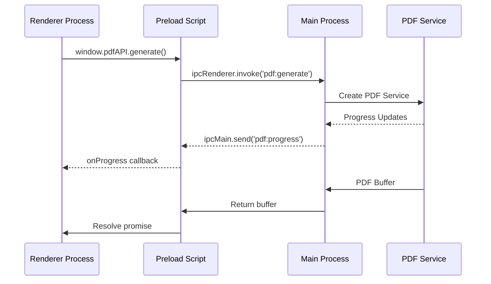

# PDF IPC Communication Protocol

## Overview
This document defines the Inter-Process Communication (IPC) protocol for PDF operations in the CaseThread Electron application. It establishes secure, type-safe communication channels between the main process (which handles PDF generation) and renderer processes (which display the UI).

## Architecture



## Channel Definitions

### 1. Channel Constants

```typescript
// src/electron/constants/pdf-channels.ts
export const PDF_CHANNELS = {
  // Renderer → Main (invoke channels)
  GENERATE: 'pdf:generate',
  EXPORT: 'pdf:export',
  CANCEL: 'pdf:cancel',
  GET_MEMORY_USAGE: 'pdf:memory-usage',
  
  // Main → Renderer (event channels)
  PROGRESS: 'pdf:progress',
  COMPLETE: 'pdf:complete',
  ERROR: 'pdf:error',
  CANCELLED: 'pdf:cancelled',
  MEMORY_WARNING: 'pdf:memory-warning',
} as const;

// Channel validation
export const isValidPDFChannel = (channel: string): boolean => {
  return Object.values(PDF_CHANNELS).includes(channel as any);
};
```

### 2. Message Type Definitions

```typescript
// src/types/pdf-ipc.ts

// Request types (Renderer → Main)
export interface PDFGenerateRequest {
  requestId: string;
  content: string;
  documentType: DocumentType;
  documentId: string;
  options?: PDFGenerationOptions;
}

export interface PDFGenerationOptions {
  fontSize?: 10 | 11 | 12;
  lineSpacing?: 'single' | 'double';
  margins?: Margins;
  includeMetadata?: boolean;
  validateSignatures?: boolean;
  watermark?: string;
}

export interface PDFExportRequest {
  requestId: string;
  buffer: ArrayBuffer;
  suggestedFileName: string;
  defaultPath?: string;
  metadata?: PDFMetadata;
}

export interface PDFCancelRequest {
  requestId: string;
  reason?: string;
}

// Response types (Main → Renderer)
export interface PDFGenerateResponse {
  requestId: string;
  success: boolean;
  data?: {
    buffer: ArrayBuffer;
    metadata: PDFMetadata;
    warnings?: string[];
  };
  error?: PDFIPCError;
}

export interface PDFProgressEvent {
  requestId: string;
  step: PDFGenerationStep;
  stepNumber: number;
  totalSteps: number;
  percentage: number;
  detail: string;
  timestamp: number;
  estimatedTimeRemaining?: number;
}

export interface PDFIPCError {
  code: PDFErrorCode;
  message: string;
  details?: unknown;
  recoverable: boolean;
  suggestion?: string;
}

export interface PDFMemoryStatus {
  used: number;
  limit: number;
  bufferCount: number;
  largestBuffer: number;
}
```

## Implementation

### 1. Preload Script API

```typescript
// src/electron/preload/pdf-api.ts
import { contextBridge, ipcRenderer } from 'electron';
import { PDF_CHANNELS, isValidPDFChannel } from '../constants/pdf-channels';
import type { 
  PDFGenerateRequest, 
  PDFGenerateResponse,
  PDFExportRequest,
  PDFProgressEvent 
} from '@/types/pdf-ipc';

// Input validation
const validateGenerateRequest = (request: PDFGenerateRequest): void => {
  if (!request.requestId || typeof request.requestId !== 'string') {
    throw new Error('Invalid requestId');
  }
  if (!request.content || typeof request.content !== 'string') {
    throw new Error('Invalid content');
  }
  if (!request.documentType || !isValidDocumentType(request.documentType)) {
    throw new Error('Invalid documentType');
  }
  if (request.options?.fontSize && ![10, 11, 12].includes(request.options.fontSize)) {
    throw new Error('Invalid fontSize - must be 10, 11, or 12');
  }
};

const pdfAPI = {
  // Generate PDF from markdown content
  generate: async (request: PDFGenerateRequest): Promise<PDFGenerateResponse> => {
    validateGenerateRequest(request);
    
    try {
      const response = await ipcRenderer.invoke(PDF_CHANNELS.GENERATE, request);
      
      // Convert buffer if needed
      if (response.data?.buffer && !(response.data.buffer instanceof ArrayBuffer)) {
        response.data.buffer = new Uint8Array(response.data.buffer).buffer;
      }
      
      return response;
    } catch (error) {
      return {
        requestId: request.requestId,
        success: false,
        error: {
          code: 'IPC_ERROR',
          message: error.message || 'IPC communication failed',
          recoverable: true,
        },
      };
    }
  },
  
  // Export PDF to file system
  export: async (request: PDFExportRequest): Promise<string> => {
    if (!request.buffer || !(request.buffer instanceof ArrayBuffer)) {
      throw new Error('Invalid buffer - must be ArrayBuffer');
    }
    if (!request.suggestedFileName) {
      throw new Error('Suggested filename is required');
    }
    
    return ipcRenderer.invoke(PDF_CHANNELS.EXPORT, request);
  },
  
  // Cancel ongoing generation
  cancel: async (requestId: string): Promise<void> => {
    if (!requestId) throw new Error('RequestId is required');
    return ipcRenderer.invoke(PDF_CHANNELS.CANCEL, { requestId });
  },
  
  // Get memory usage
  getMemoryUsage: async (): Promise<PDFMemoryStatus> => {
    return ipcRenderer.invoke(PDF_CHANNELS.GET_MEMORY_USAGE);
  },
  
  // Event listeners
  onProgress: (callback: (event: PDFProgressEvent) => void): (() => void) => {
    const handler = (_event: Electron.IpcRendererEvent, data: PDFProgressEvent) => {
      callback(data);
    };
    
    ipcRenderer.on(PDF_CHANNELS.PROGRESS, handler);
    
    // Return cleanup function
    return () => {
      ipcRenderer.removeListener(PDF_CHANNELS.PROGRESS, handler);
    };
  },
  
  onMemoryWarning: (callback: (status: PDFMemoryStatus) => void): (() => void) => {
    const handler = (_event: Electron.IpcRendererEvent, data: PDFMemoryStatus) => {
      callback(data);
    };
    
    ipcRenderer.on(PDF_CHANNELS.MEMORY_WARNING, handler);
    
    return () => {
      ipcRenderer.removeListener(PDF_CHANNELS.MEMORY_WARNING, handler);
    };
  },
};

// Expose to renderer with contextIsolation
contextBridge.exposeInMainWorld('pdfAPI', pdfAPI);
```

### 2. Main Process Handlers

```typescript
// src/electron/main/ipc/pdf-handlers.ts
import { ipcMain, dialog, BrowserWindow } from 'electron';
import { PDF_CHANNELS } from '../constants/pdf-channels';
import { PDFServiceFactory } from '@/services/pdf/PDFServiceFactory';
import { ProgressReporter } from '@/utils/progress';
import type { 
  PDFGenerateRequest,
  PDFGenerateResponse,
  PDFExportRequest,
  PDFProgressEvent 
} from '@/types/pdf-ipc';

export class PDFIPCHandlers {
  private activeGenerations = new Map<string, {
    abortController: AbortController;
    startTime: number;
    webContentsId: number;
  }>();
  
  private memoryMonitor = new PDFMemoryMonitor();
  
  register(): void {
    this.registerGenerateHandler();
    this.registerExportHandler();
    this.registerCancelHandler();
    this.registerMemoryHandler();
    
    // Start memory monitoring
    this.memoryMonitor.startMonitoring((status) => {
      // Broadcast memory warnings to all windows
      BrowserWindow.getAllWindows().forEach(window => {
        window.webContents.send(PDF_CHANNELS.MEMORY_WARNING, status);
      });
    });
  }
  
  private registerGenerateHandler(): void {
    ipcMain.handle(PDF_CHANNELS.GENERATE, async (event, request: PDFGenerateRequest) => {
      const webContents = event.sender;
      const abortController = new AbortController();
      
      // Track active generation
      this.activeGenerations.set(request.requestId, {
        abortController,
        startTime: Date.now(),
        webContentsId: webContents.id,
      });
      
      try {
        // Create progress reporter that sends IPC events
        const progressReporter = new ProgressReporter((step, detail) => {
          const progress: PDFProgressEvent = {
            requestId: request.requestId,
            step: step as PDFGenerationStep,
            stepNumber: this.getStepNumber(step),
            totalSteps: 10,
            percentage: this.calculatePercentage(step),
            detail: detail || step,
            timestamp: Date.now(),
            estimatedTimeRemaining: this.estimateTimeRemaining(request.requestId, step),
          };
          
          // Send progress update
          webContents.send(PDF_CHANNELS.PROGRESS, progress);
        });
        
        // Create PDF service
        const service = PDFServiceFactory.forGUI(progressReporter, {
          signal: abortController.signal,
        });
        
        // Generate PDF
        const result = await service.exportToBuffer(
          request.content,
          request.documentType,
          request.options
        );
        
        // Check memory before sending
        this.memoryMonitor.checkMemoryUsage(result.buffer.byteLength);
        
        const response: PDFGenerateResponse = {
          requestId: request.requestId,
          success: true,
          data: {
            buffer: result.buffer,
            metadata: {
              pageCount: result.pageCount,
              fileSize: result.buffer.byteLength,
              documentType: request.documentType,
              generatedAt: new Date(),
              generationDuration: Date.now() - this.activeGenerations.get(request.requestId)!.startTime,
              hasSignatureBlocks: result.hasSignatureBlocks,
              formFields: result.formFields || [],
            },
            warnings: result.warnings,
          },
        };
        
        // Send completion event
        webContents.send(PDF_CHANNELS.COMPLETE, {
          requestId: request.requestId,
          duration: response.data!.metadata.generationDuration,
        });
        
        return response;
        
      } catch (error) {
        // Handle cancellation
        if (error.name === 'AbortError') {
          webContents.send(PDF_CHANNELS.CANCELLED, { requestId: request.requestId });
          return {
            requestId: request.requestId,
            success: false,
            error: {
              code: 'CANCELLED',
              message: 'PDF generation was cancelled',
              recoverable: true,
            },
          };
        }
        
        // Handle other errors
        const pdfError = this.handleError(error);
        webContents.send(PDF_CHANNELS.ERROR, {
          requestId: request.requestId,
          error: pdfError,
        });
        
        return {
          requestId: request.requestId,
          success: false,
          error: pdfError,
        };
        
      } finally {
        // Cleanup
        this.activeGenerations.delete(request.requestId);
      }
    });
  }
  
  private registerExportHandler(): void {
    ipcMain.handle(PDF_CHANNELS.EXPORT, async (event, request: PDFExportRequest) => {
      const window = BrowserWindow.fromWebContents(event.sender);
      if (!window) throw new Error('Window not found');
      
      // Show save dialog
      const result = await dialog.showSaveDialog(window, {
        defaultPath: request.defaultPath || request.suggestedFileName,
        filters: [
          { name: 'PDF Documents', extensions: ['pdf'] },
          { name: 'All Files', extensions: ['*'] },
        ],
        properties: ['createDirectory', 'showOverwriteConfirmation'],
      });
      
      if (result.canceled || !result.filePath) {
        throw new Error('Export cancelled by user');
      }
      
      // Write file
      const fs = require('fs').promises;
      const buffer = Buffer.from(request.buffer);
      
      await fs.writeFile(result.filePath, buffer);
      
      // Write metadata if requested
      if (request.metadata) {
        const metadataPath = result.filePath.replace('.pdf', '.pdf.json');
        await fs.writeFile(
          metadataPath, 
          JSON.stringify(request.metadata, null, 2)
        );
      }
      
      return result.filePath;
    });
  }
  
  private registerCancelHandler(): void {
    ipcMain.handle(PDF_CHANNELS.CANCEL, async (_event, { requestId }) => {
      const generation = this.activeGenerations.get(requestId);
      if (generation) {
        generation.abortController.abort();
        this.activeGenerations.delete(requestId);
      }
    });
  }
  
  private registerMemoryHandler(): void {
    ipcMain.handle(PDF_CHANNELS.GET_MEMORY_USAGE, async () => {
      return this.memoryMonitor.getStatus();
    });
  }
  
  private handleError(error: any): PDFIPCError {
    // Map specific errors to codes
    if (error.code === 'ENOSPC') {
      return {
        code: 'DISK_SPACE',
        message: 'Insufficient disk space to save PDF',
        recoverable: false,
        suggestion: 'Free up disk space and try again',
      };
    }
    
    if (error.code === 'EACCES') {
      return {
        code: 'PERMISSION_DENIED',
        message: 'Permission denied to save PDF',
        recoverable: false,
        suggestion: 'Choose a different location or check folder permissions',
      };
    }
    
    if (error.message?.includes('Invalid signature block')) {
      return {
        code: 'INVALID_SIGNATURE',
        message: error.message,
        recoverable: true,
        suggestion: 'Check signature block format in the document',
        details: error.details,
      };
    }
    
    // Generic error
    return {
      code: 'GENERATION_FAILED',
      message: error.message || 'PDF generation failed',
      recoverable: true,
      details: error.stack,
    };
  }
  
  private calculatePercentage(step: string): number {
    const percentages: Record<string, number> = {
      'Initializing': 5,
      'Loading formatting rules': 10,
      'Parsing document': 20,
      'Extracting metadata': 25,
      'Processing signatures': 35,
      'Analyzing structure': 45,
      'Calculating layout': 55,
      'Generating pages': 70,
      'Rendering content': 85,
      'Finalizing': 95,
      'Complete': 100,
    };
    
    return percentages[step] || 0;
  }
  
  private getStepNumber(step: string): number {
    const steps = [
      'Initializing',
      'Loading formatting rules',
      'Parsing document',
      'Extracting metadata',
      'Processing signatures',
      'Analyzing structure',
      'Calculating layout',
      'Generating pages',
      'Rendering content',
      'Finalizing',
    ];
    
    return steps.indexOf(step) + 1;
  }
  
  private estimateTimeRemaining(requestId: string, currentStep: string): number | undefined {
    const generation = this.activeGenerations.get(requestId);
    if (!generation) return undefined;
    
    const elapsed = Date.now() - generation.startTime;
    const percentage = this.calculatePercentage(currentStep);
    
    if (percentage === 0) return undefined;
    
    const totalEstimate = (elapsed / percentage) * 100;
    const remaining = totalEstimate - elapsed;
    
    return Math.max(0, Math.round(remaining / 1000)); // Return seconds
  }
}

// Memory monitoring utility
class PDFMemoryMonitor {
  private readonly MEMORY_LIMIT = 200 * 1024 * 1024; // 200MB
  private readonly WARNING_THRESHOLD = 0.8; // 80%
  private currentUsage = 0;
  private bufferCount = 0;
  
  checkMemoryUsage(bufferSize: number): void {
    this.currentUsage += bufferSize;
    this.bufferCount++;
    
    if (this.currentUsage > this.MEMORY_LIMIT * this.WARNING_THRESHOLD) {
      // Memory warning will be sent via monitoring
    }
  }
  
  releaseMemory(bufferSize: number): void {
    this.currentUsage = Math.max(0, this.currentUsage - bufferSize);
    this.bufferCount = Math.max(0, this.bufferCount - 1);
  }
  
  getStatus(): PDFMemoryStatus {
    return {
      used: this.currentUsage,
      limit: this.MEMORY_LIMIT,
      bufferCount: this.bufferCount,
      largestBuffer: 0, // Track if needed
    };
  }
  
  startMonitoring(callback: (status: PDFMemoryStatus) => void): void {
    setInterval(() => {
      const status = this.getStatus();
      if (status.used > this.MEMORY_LIMIT * this.WARNING_THRESHOLD) {
        callback(status);
      }
    }, 5000); // Check every 5 seconds
  }
}
```

### 3. Renderer Process Integration

```typescript
// src/electron/renderer/src/hooks/usePDFIPC.ts
import { useState, useCallback, useEffect, useRef } from 'react';
import type { PDFGenerateResponse, PDFProgressEvent } from '@/types/pdf-ipc';

export const usePDFIPC = () => {
  const [isGenerating, setIsGenerating] = useState(false);
  const [progress, setProgress] = useState<PDFProgressEvent | null>(null);
  const [error, setError] = useState<Error | null>(null);
  const [memoryStatus, setMemoryStatus] = useState<PDFMemoryStatus | null>(null);
  
  const activeRequestRef = useRef<string | null>(null);
  const progressUnsubscribeRef = useRef<(() => void) | null>(null);
  
  // Set up memory warning listener
  useEffect(() => {
    const unsubscribe = window.pdfAPI.onMemoryWarning((status) => {
      setMemoryStatus(status);
      console.warn('PDF memory warning:', status);
    });
    
    return unsubscribe;
  }, []);
  
  const generatePDF = useCallback(async (
    content: string,
    documentType: string,
    documentId: string,
    options?: PDFGenerationOptions
  ): Promise<PDFGenerateResponse> => {
    const requestId = crypto.randomUUID();
    activeRequestRef.current = requestId;
    
    setIsGenerating(true);
    setError(null);
    setProgress(null);
    
    // Set up progress listener
    progressUnsubscribeRef.current = window.pdfAPI.onProgress((event) => {
      if (event.requestId === requestId) {
        setProgress(event);
      }
    });
    
    try {
      const response = await window.pdfAPI.generate({
        requestId,
        content,
        documentType,
        documentId,
        options,
      });
      
      if (!response.success) {
        throw new Error(response.error?.message || 'PDF generation failed');
      }
      
      return response;
      
    } catch (err) {
      setError(err as Error);
      throw err;
    } finally {
      setIsGenerating(false);
      activeRequestRef.current = null;
      
      // Cleanup progress listener
      if (progressUnsubscribeRef.current) {
        progressUnsubscribeRef.current();
        progressUnsubscribeRef.current = null;
      }
    }
  }, []);
  
  const cancelGeneration = useCallback(async () => {
    if (activeRequestRef.current) {
      await window.pdfAPI.cancel(activeRequestRef.current);
      setIsGenerating(false);
      setProgress(null);
    }
  }, []);
  
  const exportPDF = useCallback(async (
    buffer: ArrayBuffer,
    suggestedFileName: string,
    metadata?: PDFMetadata
  ): Promise<string> => {
    return window.pdfAPI.export({
      requestId: crypto.randomUUID(),
      buffer,
      suggestedFileName,
      metadata,
    });
  }, []);
  
  const checkMemoryUsage = useCallback(async () => {
    const status = await window.pdfAPI.getMemoryUsage();
    setMemoryStatus(status);
    return status;
  }, []);
  
  // Cleanup on unmount
  useEffect(() => {
    return () => {
      if (progressUnsubscribeRef.current) {
        progressUnsubscribeRef.current();
      }
      if (activeRequestRef.current) {
        window.pdfAPI.cancel(activeRequestRef.current);
      }
    };
  }, []);
  
  return {
    generatePDF,
    cancelGeneration,
    exportPDF,
    checkMemoryUsage,
    isGenerating,
    progress,
    error,
    memoryStatus,
  };
};
```

## Security Considerations

### 1. Input Validation
- All inputs are validated in the preload script before IPC
- Document types are checked against allowed values
- File paths are sanitized and validated
- Buffer sizes are checked against memory limits

### 2. Channel Security
- Only specific channels are exposed via contextBridge
- No direct access to Node.js APIs from renderer
- All file system operations happen in main process
- Path traversal attacks prevented

### 3. Memory Protection
- Maximum buffer size limits enforced
- Automatic cleanup of old buffers
- Memory usage monitoring and warnings
- Graceful degradation when limits reached

### 4. Error Information
- Stack traces excluded from production builds
- Sensitive paths sanitized in error messages
- User-friendly error messages provided
- Recovery suggestions included

## Error Handling

### Error Code Reference

| Code | Description | Recoverable | User Action |
|------|-------------|-------------|-------------|
| `INVALID_DOCUMENT` | Document format invalid | No | Fix document format |
| `INVALID_SIGNATURE` | Signature block format error | Yes | Check signature format |
| `MEMORY_LIMIT` | Memory limit exceeded | Yes | Close other PDFs |
| `DISK_SPACE` | Insufficient disk space | No | Free up space |
| `PERMISSION_DENIED` | No write permission | No | Choose different location |
| `CANCELLED` | User cancelled operation | Yes | Retry if needed |
| `NETWORK_ERROR` | Network request failed | Yes | Check connection |
| `GENERATION_FAILED` | Generic generation error | Yes | Retry operation |

## Testing Guidelines

### 1. Unit Tests
```typescript
// Test request validation
describe('PDF IPC Validation', () => {
  it('should reject invalid document types', async () => {
    await expect(window.pdfAPI.generate({
      requestId: '123',
      content: 'test',
      documentType: 'invalid-type' as any,
      documentId: 'doc1',
    })).rejects.toThrow('Invalid documentType');
  });
});
```

### 2. Integration Tests
```typescript
// Test full IPC flow
describe('PDF IPC Integration', () => {
  it('should generate PDF with progress updates', async () => {
    const progressEvents: PDFProgressEvent[] = [];
    
    const unsubscribe = window.pdfAPI.onProgress((event) => {
      progressEvents.push(event);
    });
    
    const response = await window.pdfAPI.generate({
      requestId: 'test-123',
      content: '# Test Document',
      documentType: 'nda',
      documentId: 'doc1',
    });
    
    expect(response.success).toBe(true);
    expect(progressEvents.length).toBeGreaterThan(0);
    expect(progressEvents[progressEvents.length - 1].percentage).toBe(100);
    
    unsubscribe();
  });
});
```

## Performance Considerations

### 1. Buffer Transfer
- Use ArrayBuffer for efficient memory transfer
- Implement streaming for very large PDFs (future)
- Consider chunking for progress granularity

### 2. Concurrent Operations
- Limit concurrent PDF generations
- Queue requests when at capacity
- Provide queue position feedback

### 3. Memory Management
- Monitor memory usage continuously
- Implement automatic cleanup
- Warn users before limits reached
- Provide memory usage statistics

## Future Enhancements

1. **Streaming Support**: For very large PDFs
2. **Batch Operations**: Generate multiple PDFs
3. **Preview Generation**: Low-res preview before full PDF
4. **Incremental Updates**: Update existing PDFs
5. **Collaborative Features**: Multi-user PDF generation
6. **Cloud Integration**: Save to cloud storage
7. **Template Management**: Custom PDF templates
8. **Analytics**: Track generation metrics

## Summary

This IPC protocol provides:
- Type-safe communication between processes
- Comprehensive error handling and recovery
- Progress tracking with time estimates
- Memory usage monitoring and protection
- Security through input validation and channel isolation
- Extensible architecture for future features 