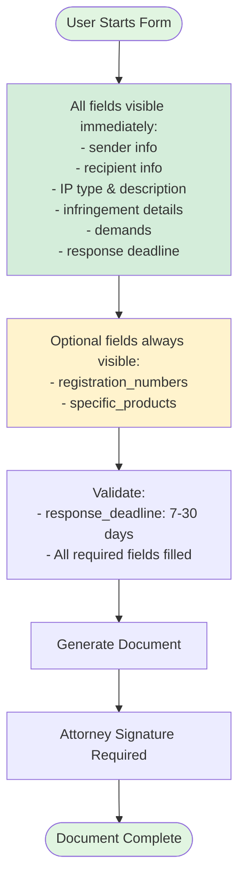

# Cease and Desist Letter - Conditional Logic

## Visual Diagram

## Text Description for AI Agents

### Template: cease-and-desist-letter
**Conditional Fields**: NONE
**Always Visible**: ALL fields
**Optional Fields**: 2 (registration_numbers, specific_products)

### Form Flow:
1. **Initial State**: All fields are visible when form loads
2. **No Conditional Logic**: This template has no fields that show/hide based on other selections
3. **Optional Fields**: 
   - `registration_numbers` - Can be left blank
   - `specific_products` - Can be left blank
4. **Validation Required**:
   - `response_deadline` must be between 7 and 30 days
   - All other required fields must be filled
5. **Signature**: Only attorney signature required (no client signature)

### Implementation Notes:
- Simplest template to implement
- No JavaScript show/hide logic needed
- All fields can be laid out statically
- Good starting point for GUI development 