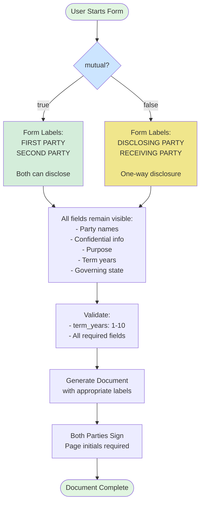

# NDA IP Specific - Conditional Logic

## Visual Diagram

## Text Description for AI Agents

### Template: nda-ip-specific
**Trigger Field**: `mutual` (boolean)
**Conditional Behavior**: Label changes only (no fields show/hide)
**All Fields**: Always visible regardless of mutual selection

### Form Flow:
1. **Initial State**: All fields visible with default labels
2. **Decision Point**: User selects mutual (Yes/No)
3. **If MUTUAL (true)**:
   - Change party labels to "FIRST PARTY" and "SECOND PARTY"
   - Document allows bidirectional disclosure
   - Both parties can share confidential information
4. **If UNILATERAL (false)**:
   - Change party labels to "DISCLOSING PARTY" and "RECEIVING PARTY"  
   - Document allows one-way disclosure only
   - Only disclosing party shares information
5. **No Field Changes**: All fields remain visible and required

### Label Mapping:
| Field | Mutual=True Label | Mutual=False Label |
|-------|------------------|-------------------|
| disclosing_party | First Party | Disclosing Party |
| receiving_party | Second Party | Receiving Party |

### Special Features:
- Page initials required on each page
- Both parties always sign
- No fields appear/disappear

### Implementation Notes:
- Simple label swap based on boolean
- No show/hide logic needed
- Consider updating labels dynamically in form
- Document generation handles label substitution 