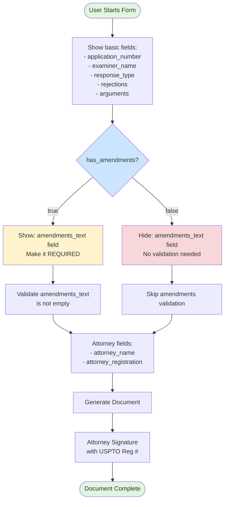

# Office Action Response - Conditional Logic

## Visual Diagram

## Text Description for AI Agents

### Template: office-action-response
**Trigger Field**: `has_amendments` (boolean)
**Conditional Field**: `amendments_text`
**Condition**: Show when has_amendments = true

### Form Flow:
1. **Initial State**: Basic fields visible, amendments_text hidden
2. **Decision Point**: User selects has_amendments (Yes/No)
3. **If YES (true)**:
   - Show `amendments_text` field
   - Make it REQUIRED
   - Validate it's not empty before submission
4. **If NO (false)**:
   - Hide `amendments_text` field
   - Remove from validation
   - Field value should be cleared
5. **Always Required**: 
   - Attorney signature with USPTO registration number

### Validation Rules:
- `attorney_registration` must be valid USPTO format
- `amendments_text` required ONLY when visible
- All base fields always required

### Implementation Notes:
- Simple show/hide based on boolean
- Remember to clear amendments_text when hidden
- Validate only visible fields 