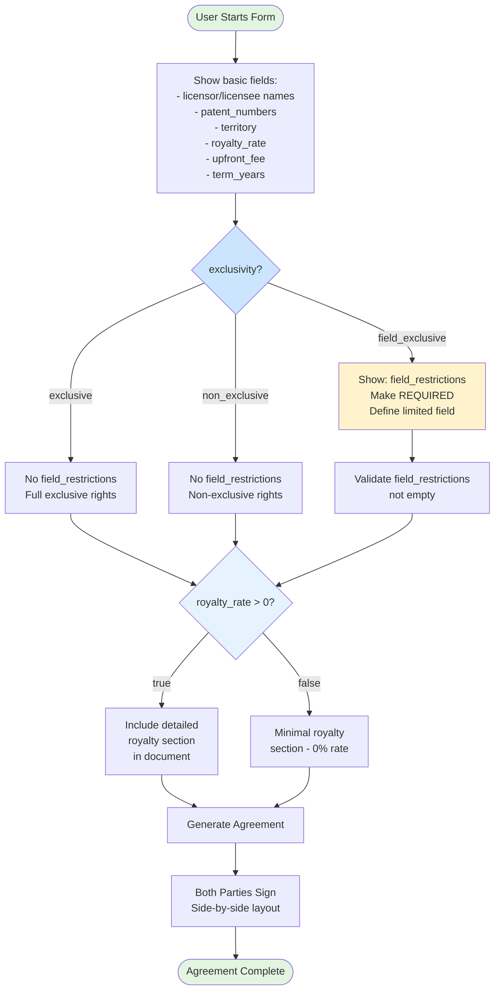

# Patent License Agreement - Conditional Logic

## Visual Diagram

## Text Description for AI Agents

### Template: patent-license-agreement
**Trigger Field**: `exclusivity` (select: "exclusive", "non_exclusive", "field_exclusive")
**Conditional Field**: `field_restrictions`
**Condition**: Show when exclusivity = "field_exclusive"

### Form Flow:
1. **Initial State**: Basic fields visible, field_restrictions hidden
2. **Decision Point 1**: User selects exclusivity type
3. **If "FIELD_EXCLUSIVE" Selected**:
   - Show `field_restrictions` field
   - Make it REQUIRED
   - User must specify the limited field of use
4. **If "EXCLUSIVE" or "NON_EXCLUSIVE" Selected**:
   - Keep `field_restrictions` hidden
   - No field limitations apply
5. **Decision Point 2**: Check royalty_rate value
6. **If royalty_rate > 0**:
   - Include detailed royalty calculation section
7. **If royalty_rate = 0**:
   - Minimal royalty section (paid-up license)

### Optional Fields:
- `sublicense_rights` - Always visible but optional

### Signatures:
- Both parties (licensor & licensee) required
- Side-by-side layout for equal parties
- No witness/notary required

### Implementation Notes:
- Place exclusivity field BEFORE field_restrictions
- Clear field_restrictions when changing from field_exclusive
- Royalty section is dynamic based on rate value
- Consider showing example text for field restrictions 