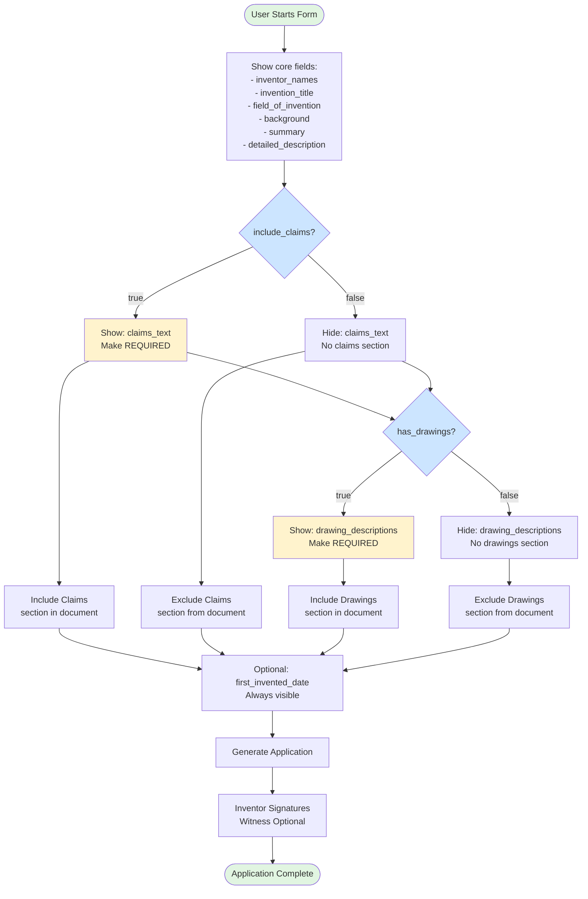

# Provisional Patent Application - Conditional Logic

## Visual Diagram

## Text Description for AI Agents

### Template: provisional-patent-application
**Trigger Fields**: 2 boolean fields
**Conditional Fields**: 2 text fields
**Conditional Sections**: 2 document sections

### Decision Tree:
1. **include_claims** (boolean)
   - If true: Show claims_text field (REQUIRED)
   - If false: Hide claims_text field
   - Controls: Claims section in document

2. **has_drawings** (boolean)
   - If true: Show drawing_descriptions field (REQUIRED)
   - If false: Hide drawing_descriptions field
   - Controls: Drawings section in document

### Form States:
- **Minimal**: No claims, no drawings (shortest document)
- **Claims Only**: Include claims but no drawings
- **Drawings Only**: Include drawings but no claims
- **Full**: Both claims and drawings (longest document)

### Always Visible:
- All core invention description fields
- `first_invented_date` (optional) - always visible

### Signatures:
- All inventors must sign (parse comma-separated names)
- Witness signature is OPTIONAL
- Multiple inventor support required

### Document Structure Impact:
The final document length varies significantly:
- Base document: ~5-6 sections
- +Claims: Adds claims section
- +Drawings: Adds drawings/figures section
- Both: Full patent application format

### Implementation Notes:
- These are independent toggles (not dependent on each other)
- Clear field values when hiding
- Consider section preview in form
- Parse inventor_names for multiple signatures 