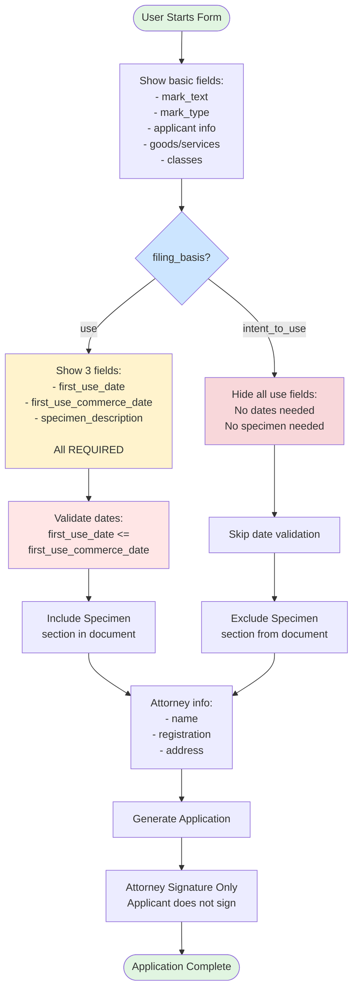

# Trademark Application - Conditional Logic

## Visual Diagram

## Text Description for AI Agents

### Template: trademark-application
**Trigger Field**: `filing_basis` (select: "use" or "intent_to_use")
**Conditional Fields**: 3 fields + 1 document section
**All Conditional on**: filing_basis = "use"

### Form Flow:
1. **Initial State**: Basic fields visible, use-related fields hidden
2. **Decision Point**: User selects filing_basis
3. **If "USE" Selected**:
   - Show `first_use_date` (REQUIRED)
   - Show `first_use_commerce_date` (REQUIRED)
   - Show `specimen_description` (REQUIRED)
   - Include specimen section in final document
4. **If "INTENT TO USE" Selected**:
   - Hide all three use-related fields
   - Clear any values in hidden fields
   - Exclude specimen section from document

### Critical Validation:
- **Date Relationship**: first_use_date must be <= first_use_commerce_date
- **Only When Visible**: Only validate dates when filing_basis = "use"
- **Attorney Registration**: Always validate USPTO format

### Document Generation:
- Specimen section appears ONLY for use-based applications
- Intent-to-use applications are shorter (no specimen)
- Only attorney signs (applicant does NOT sign)

### Implementation Notes:
- Place filing_basis field BEFORE date fields
- Clear date values when switching to intent_to_use
- Date picker for commerce date should set min date = first_use_date
- Consider disabling commerce date until first_use_date is set 