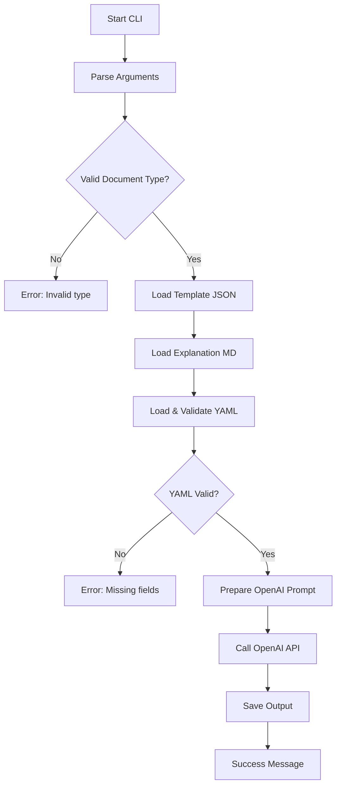

# CLI Proof of Concept Plan

## Overview
Build a TypeScript CLI tool that generates legal documents by sending template, explanation, and user data to OpenAI's 'o3' model.

## Command Structure
```bash
# Basic usage
casethread-poc generate <document-type> <input-yaml-path> [options]

# Example
casethread-poc generate patent-assignment ./test-data/tfs-01-patent-assignment.yaml --output ./output/
```

## Technical Architecture

### 1. Core Components

```
src/
├── index.ts              # CLI entry point
├── commands/
│   └── generate.ts       # Generate command handler
├── services/
│   ├── openai.ts         # OpenAI API integration
│   ├── template.ts       # Template loading and validation
│   └── yaml.ts          # YAML parsing and validation
├── utils/
│   ├── spinner.ts        # Progress indicator
│   ├── logger.ts         # Debug logging
│   └── validator.ts      # Input validation
└── types/
    └── index.ts          # TypeScript interfaces
```

### 2. Dependencies
```json
{
  "dependencies": {
    "commander": "^11.0.0",      // CLI framework
    "openai": "^4.0.0",          // OpenAI SDK
    "js-yaml": "^4.1.0",         // YAML parsing
    "ora": "^7.0.0",             // Spinner
    "winston": "^3.0.0",         // Logging
    "dotenv": "^16.0.0",         // Environment variables
    "chalk": "^5.0.0"            // Terminal colors
  },
  "devDependencies": {
    "@types/node": "^20.0.0",
    "@types/js-yaml": "^4.0.0",
    "typescript": "^5.0.0",
    "jest": "^29.0.0",
    "@types/jest": "^29.0.0",
    "ts-jest": "^29.0.0",
    "ts-node": "^10.0.0"
  }
}
```

### 3. Execution Flow



### 4. Spinner States
The spinner will show real-time status updates:
- ⏳ Validating document type...
- 📄 Loading template files...
- 🔍 Validating input data...
- 🤖 Connecting to OpenAI...
- 📡 Generating document (this may take 30-60 seconds)...
- 💾 Saving output...
- ✅ Document generated successfully!

### 5. OpenAI Prompt Structure

```typescript
const prompt = `
You are a legal document generator. Create a professional legal document based on the following:

1. TEMPLATE STRUCTURE:
${JSON.stringify(template, null, 2)}

2. TEMPLATE EXPLANATION:
${explanationContent}

3. DOCUMENT DETAILS:
${JSON.stringify(yamlData, null, 2)}

Please generate a complete legal document in Markdown format that:
- Follows the structure defined in the template
- Incorporates all details from the YAML data
- Adheres to the guidelines in the explanation
- Uses professional legal language appropriate for the document type

Return only the formatted document without any additional commentary.
`;
```

### 6. File Structure for Implementation

#### `src/index.ts`
```typescript
#!/usr/bin/env node
import { Command } from 'commander';
import { generateCommand } from './commands/generate';

const program = new Command();

program
  .name('casethread-poc')
  .description('CaseThread CLI Proof of Concept')
  .version('0.1.0');

program.addCommand(generateCommand);

program.parse();
```

#### `src/commands/generate.ts`
```typescript
import { Command } from 'commander';
import ora from 'ora';
import { generateDocument } from '../services/generator';

export const generateCommand = new Command('generate')
  .description('Generate a legal document')
  .argument('<type>', 'Document type')
  .argument('<input>', 'Path to YAML input file')
  .option('-o, --output <path>', 'Output directory', '.')
  .action(async (type, input, options) => {
    const spinner = ora('Initializing...').start();
    
    try {
      await generateDocument(type, input, options, spinner);
    } catch (error) {
      spinner.fail(`Error: ${error.message}`);
      process.exit(1);
    }
  });
```

### 7. Error Handling Strategy
- **Invalid document type**: Show list of supported types
- **Missing YAML fields**: Show which fields are required
- **OpenAI API errors**: Log full error, show user-friendly message
- **File not found**: Clear message with path attempted
- **API rate limits**: Suggest retry with backoff

### 8. Testing Strategy

#### Unit Tests
```typescript
// __tests__/validator.test.ts
describe('Document Type Validator', () => {
  test('accepts valid document types', () => {
    expect(isValidDocumentType('patent-assignment')).toBe(true);
  });
  
  test('rejects invalid document types', () => {
    expect(isValidDocumentType('invalid-type')).toBe(false);
  });
});
```

#### Integration Tests
```typescript
// __tests__/generate.integration.test.ts
describe('Document Generation', () => {
  test('generates patent assignment successfully', async () => {
    const result = await generateDocument(
      'patent-assignment',
      'test-data/patent-assignment.yaml',
      { output: './test-output' }
    );
    
    expect(result).toBeDefined();
    expect(fs.existsSync(result.outputPath)).toBe(true);
  });
});
```

### 9. Configuration

#### `.env` Structure
```env
OPENAI_API_KEY=your-api-key
OPENAI_MODEL=o3
OPENAI_TEMPERATURE=0.2
DEBUG_LOG_PATH=./debug.log
```

### 10. Output File Naming
```
[document-type]-[timestamp].md
Example: patent-assignment-2024-01-15-143052.md
```

## Implementation Steps

1. **Day 1: Project Setup**
   - Initialize TypeScript project
   - Install dependencies
   - Create folder structure
   - Set up Jest configuration

2. **Day 2: Core Services**
   - Template loader
   - YAML parser with validation
   - Logger setup
   - Type definitions

3. **Day 3: OpenAI Integration**
   - API client setup
   - Prompt builder
   - Error handling
   - Response processing

4. **Day 4: CLI Interface**
   - Commander setup
   - Spinner integration
   - Command implementation
   - Output management

5. **Day 5: Testing & Polish**
   - Unit tests
   - Integration tests
   - Error scenarios
   - Documentation

## Success Criteria
1. ✅ Accepts valid document type and YAML path
2. ✅ Validates inputs before API call
3. ✅ Shows progress with spinner
4. ✅ Generates document via OpenAI
5. ✅ Saves output as Markdown
6. ✅ Logs debug info to file
7. ✅ Shows errors in console
8. ✅ Passes all tests with `npm test`

## Next Steps After POC
- Add streaming support when available
- Implement template caching
- Add cost estimation
- Create review interface
- Add batch processing
- Implement retry logic 