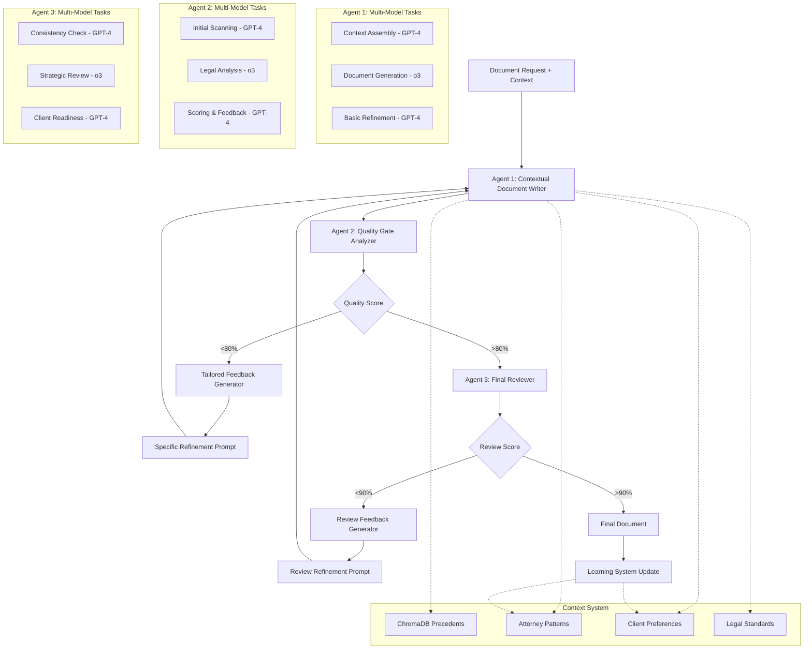

# CaseThread Multi-Model 3-Agent Quality Pipeline
## Project Plan & Technical Specification

**Version**: 2.1  
**Date**: January 11, 2025  
**Project**: CaseThread Quality-First Document Generation with Strategic Model Selection  
**Objective**: Implement cost-optimized 3-agent quality pipeline with strategic GPT-4/o3 selection for IP attorneys

---

## Executive Summary

This project transforms CaseThread from a speed-focused single-call system into a quality-focused 3-agent pipeline with strategic model selection. The goal is to achieve partner-level document quality through iterative refinement, contextual intelligence, and rigorous quality gates - specifically designed for IP attorneys who value accuracy over speed.

**Key Principles:**
- Quality over speed (25-35 seconds vs 6 seconds)
- 3 specialized agents with strategic model selection (GPT-4 + o3)
- Cost optimization: 40-50% reduction vs all-o3 approach
- Iterative refinement with tailored feedback
- Contextual intelligence using existing ChromaDB system
- IP attorney workflow optimization

---

## 1. Current State Analysis

### 1.1 Existing Architecture
CaseThread already has a sophisticated multi-agent system:

**Working Components:**
- **ContextBuilderAgent**: Retrieves relevant context from ChromaDB
- **DraftingAgent**: Generates documents using OpenAI o3
- **OverseerAgent**: Merges partial drafts (parallel processing)
- **Orchestrator**: Manages pipeline flow
- **ChromaDB System**: Vector search with legal precedents
- **Rich Mock Data**: High-quality legal memos and strategic analysis

**Current Flows:**
1. **Standard**: Context Builder → Drafting Agent → Save Document
2. **Parallel**: Context Builder → Multiple Drafting Agents → Overseer → Save Document

### 1.2 Critical Issues
1. **Context Not Used**: `ContextBundle` is retrieved but NOT passed to OpenAI service
2. **No Quality Gates**: Single-shot generation with no refinement
3. **No Feedback Loops**: Failed documents aren't improved
4. **Speed Over Quality**: Optimized for 6 seconds, not legal accuracy

### 1.3 Technology Stack
- **Language**: TypeScript, Node.js 20
- **AI Model**: OpenAI o3
- **Vector DB**: ChromaDB with embeddings
- **Container**: Docker with docker-compose
- **Templates**: 8 IP document types (Patent Assignment, NDA, etc.)
- **Test Coverage**: 266 tests, 65.77% coverage

---

## 2. 3-Agent Quality Pipeline Architecture

### 2.1 Multi-Model System Overview



### 2.2 Agent Responsibilities with Strategic Model Selection

**Agent 1: Contextual Document Writer**
- **Context Assembly** (GPT-4): Organize and structure retrieved ChromaDB context
- **Document Generation** (o3): Core legal writing with context integration
- **Basic Refinement** (GPT-4): Handle simple revision requests and improvements

**Agent 2: Quality Gate Analyzer**
- **Initial Scanning** (GPT-4): Basic completeness and formatting checks
- **Legal Analysis** (o3): Complex legal accuracy and risk assessment
- **Scoring & Feedback** (GPT-4): Generate structured feedback and quality scores

**Agent 3: Final Reviewer**
- **Consistency Check** (GPT-4): Cross-reference consistency across document
- **Strategic Review** (o3): Partner-level strategic positioning and final quality
- **Client Readiness** (GPT-4): Final formatting and presentation polish

---

## 3. Detailed Agent Specifications

### 3.1 Agent 1: Contextual Document Writer (Multi-Model)

**Purpose**: Generate and refine legal documents with full contextual awareness using strategic model selection

**Model Selection Strategy:**
- **Context Assembly**: GPT-4 (organizational task)
- **Document Generation**: o3 (complex legal reasoning)
- **Basic Refinement**: GPT-4 (processing task)

**Input Data Model:**
```typescript
interface ContextualWriterInput {
  // Standard inputs
  template: Template;
  matterContext: MatterContext;
  contextBundle: ContextBundle; // NOW USED!
  
  // Refinement inputs (when iterating)
  refinementRequest?: {
    iterationNumber: number;
    qualityFeedback: QualityFeedback;
    specificInstructions: string[];
    focusAreas: string[];
    previousAttempt: string;
  };
  
  // Generation settings
  generationSettings: {
    tone: 'formal' | 'business' | 'conversational';
    riskProfile: 'conservative' | 'moderate' | 'aggressive';
    complexity: 'simple' | 'standard' | 'complex';
  };
}
```

**Output Data Model:**
```typescript
interface ContextualWriterOutput {
  generatedDocument: string;
  generationMetadata: {
    iterationNumber: number;
    contextUtilized: {
      precedentsReferenced: number;
      attorneyPatternsApplied: number;
      riskFactorsAddressed: number;
    };
    refinementsFocused: string[];
    confidenceScore: number;
    tokenUsage: TokenUsage;
  };
}
```

**Context Assembly Prompt (GPT-4):**
```
You are organizing legal context for document generation. Structure and prioritize the provided context for optimal use by the legal writing system.

CONTEXT INPUTS:
- ChromaDB Precedents: {{contextBundle.embeddings}}
- Attorney Patterns: {{attorneyPatterns}}
- Client Preferences: {{clientPreferences}}
- Risk Factors: {{riskFactors}}

ORGANIZATION REQUIREMENTS:
1. Prioritize precedents by relevance and similarity
2. Identify key attorney patterns applicable to this document type
3. Highlight client-specific preferences and requirements
4. Organize risk factors by severity and mitigation strategies
5. Create coherent context structure for legal writing

Output structured context bundle with priority rankings.
```

**Document Generation Prompt (o3):**
```
You are a senior IP attorney drafting a {{documentType}} for {{client}}. Generate a professional, comprehensive legal document using the structured context provided.

CLIENT MATTER:
- Client: {{client}}
- Attorney: {{attorney}}
- Document Type: {{documentType}}
- Jurisdiction: {{jurisdiction}}
- Risk Profile: {{riskProfile}}
- Complexity Level: {{complexity}}

STRUCTURED CONTEXT:
{{structuredContext}}

GENERATION REQUIREMENTS:
1. Follow template structure exactly
2. Incorporate relevant precedent language
3. Address all identified risk factors
4. Use attorney-preferred patterns
5. Maintain professional IP law standards
6. Include appropriate disclaimers
7. Ensure enforceability and compliance

QUALITY STANDARDS:
- Complete all template sections
- No placeholder text
- Consistent terminology
- Appropriate legal complexity
- Professional formatting
- Strategic positioning

Generate the complete document in markdown format.
```

**Refinement Prompt (when quality fails):**
```
You are refining a {{documentType}} that did not meet quality standards. Focus specifically on the identified issues and create an improved version.

ORIGINAL DOCUMENT:
{{previousAttempt}}

QUALITY FEEDBACK:
Overall Score: {{qualityScore}}/100
{{#each qualityIssues}}
- {{category}}: {{issue}} (Severity: {{severity}})
  Recommendation: {{recommendation}}
{{/each}}

SPECIFIC REFINEMENT INSTRUCTIONS:
{{#each specificInstructions}}
- {{instruction}}
{{/each}}

FOCUS AREAS FOR THIS ITERATION:
{{#each focusAreas}}
- {{area}}
{{/each}}

REFINEMENT OBJECTIVES:
1. Address each quality issue specifically
2. Improve weak areas identified in feedback
3. Maintain strengths from previous version
4. Ensure legal accuracy and completeness
5. Elevate professional tone and clarity

Generate the improved document focusing on the identified issues.
```

### 3.2 Agent 2: Quality Gate Analyzer (Multi-Model)

**Purpose**: Rigorous legal document analysis with actionable feedback using strategic model selection

**Model Selection Strategy:**
- **Initial Scanning**: GPT-4 (basic analysis task)
- **Legal Analysis**: o3 (complex legal reasoning)
- **Scoring & Feedback**: GPT-4 (processing and organization)

**Input Data Model:**
```typescript
interface QualityAnalyzerInput {
  generatedDocument: string;
  template: Template;
  matterContext: MatterContext;
  expectedStandards: {
    legalAccuracy: number;
    completeness: number;
    consistency: number;
    professionalTone: number;
    riskMitigation: number;
  };
}
```

**Output Data Model:**
```typescript
interface QualityAnalyzerOutput {
  qualityScore: number; // 0-100
  passesGate: boolean; // true if >80
  detailedAnalysis: {
    legalAccuracy: QualityMetric;
    completeness: QualityMetric;
    consistency: QualityMetric;
    professionalTone: QualityMetric;
    riskMitigation: QualityMetric;
  };
  specificFeedback: QualityFeedback[];
  recommendedActions: string[];
}

interface QualityMetric {
  score: number;
  passed: boolean;
  issues: string[];
  recommendations: string[];
}

interface QualityFeedback {
  category: string;
  severity: 'critical' | 'high' | 'medium' | 'low';
  issue: string;
  recommendation: string;
  example?: string;
}
```

**Quality Analysis Prompt:**
```
You are a senior partner conducting rigorous quality review of a {{documentType}}. Analyze this document against the highest professional standards and provide detailed feedback.

DOCUMENT TO REVIEW:
{{generatedDocument}}

QUALITY CRITERIA (Each scored 0-100):

1. LEGAL ACCURACY (Weight: 25%)
   - Correct legal terminology
   - Accurate citations and references
   - Proper legal concepts application
   - Jurisdiction-specific requirements

2. COMPLETENESS (Weight: 25%)
   - All template sections filled
   - No missing required elements
   - Comprehensive coverage of legal aspects
   - Appropriate level of detail

3. CONSISTENCY (Weight: 20%)
   - Consistent terminology throughout
   - Logical flow and structure
   - Uniform formatting and style
   - Coherent legal arguments

4. PROFESSIONAL TONE (Weight: 15%)
   - Appropriate formality level
   - Clear, unambiguous language
   - Professional legal writing style
   - Client-appropriate communication

5. RISK MITIGATION (Weight: 15%)
   - Identified and addressed risks
   - Appropriate protective language
   - Liability limitation clauses
   - Compliance considerations

ANALYSIS REQUIREMENTS:
1. Score each criterion (0-100)
2. Calculate weighted overall score
3. Identify specific issues with severity
4. Provide actionable recommendations
5. Suggest concrete improvements

PASSING THRESHOLD: 80/100
If score < 80: Provide specific refinement instructions
If score ≥ 80: Approve for final review

Format response as JSON with detailed feedback.
```

### 3.3 Agent 3: Final Reviewer (Multi-Model)

**Purpose**: Partner-level final review and strategic positioning using strategic model selection

**Model Selection Strategy:**
- **Consistency Check**: GPT-4 (systematic verification task)
- **Strategic Review**: o3 (complex strategic analysis)
- **Client Readiness**: GPT-4 (formatting and presentation)

**Input Data Model:**
```typescript
interface FinalReviewerInput {
  qualityApprovedDocument: string;
  template: Template;
  matterContext: MatterContext;
  qualityAnalysis: QualityAnalyzerOutput;
  clientProfile?: ClientProfile;
  strategicConsiderations?: string[];
}
```

**Output Data Model:**
```typescript
interface FinalReviewerOutput {
  finalScore: number; // 0-100
  approvedForDelivery: boolean; // true if >90
  strategicEnhancements: string[];
  finalDocument: string;
  deliveryNotes: string[];
  nextSteps: string[];
}
```

**Final Review Prompt:**
```
You are a senior partner conducting final review of a {{documentType}} for {{client}}. This document has passed quality gates and now needs strategic positioning and final polish.

DOCUMENT FOR FINAL REVIEW:
{{qualityApprovedDocument}}

QUALITY ANALYSIS PASSED:
Overall Score: {{qualityScore}}/100
Strengths: {{#each strengths}}{{.}}{{/each}}

CLIENT CONTEXT:
- Client: {{client}}
- Industry: {{industry}}
- Relationship: {{relationshipType}}
- Risk Tolerance: {{riskTolerance}}

STRATEGIC CONSIDERATIONS:
{{#each strategicConsiderations}}
- {{consideration}}
{{/each}}

FINAL REVIEW CRITERIA:

1. STRATEGIC POSITIONING (30%)
   - Alignment with client objectives
   - Competitive advantage considerations
   - Long-term relationship building
   - Industry-specific nuances

2. CLIENT RELATIONSHIP (25%)
   - Appropriate tone for client
   - Communication style match
   - Expectation management
   - Trust and confidence building

3. BUSINESS IMPACT (20%)
   - Commercial viability
   - Implementation practicality
   - Cost-benefit considerations
   - Timeline feasibility

4. RISK OPTIMIZATION (15%)
   - Balanced risk allocation
   - Practical enforceability
   - Jurisdiction-specific optimization
   - Future-proofing considerations

5. PROFESSIONAL EXCELLENCE (10%)
   - Partner-level quality
   - Firm reputation enhancement
   - Competitive differentiation
   - Value demonstration

FINAL REVIEW REQUIREMENTS:
1. Score overall readiness (0-100)
2. Identify strategic enhancements
3. Provide delivery recommendations
4. Suggest client communication strategy
5. Recommend next steps

APPROVAL THRESHOLD: 90/100
If score < 90: Provide specific final refinements
If score ≥ 90: Approve for client delivery

Provide comprehensive final assessment.
```

---

## 4. Enhanced Data Models

### 4.1 Context Integration Models

```typescript
// Enhanced Context Bundle (extends existing)
interface EnhancedContextBundle extends ContextBundle {
  attorneyPatterns: AttorneyPattern[];
  clientPreferences: ClientPreference[];
  qualityStandards: QualityStandard[];
  strategicGuidance: StrategicGuidance[];
  riskFactors: RiskFactor[];
}

// Attorney Pattern Learning
interface AttorneyPattern {
  id: string;
  attorneyId: string;
  pattern: string;
  implementation: string;
  successRate: number;
  documentTypes: string[];
  lastUpdated: Date;
}

// Quality Standards
interface QualityStandard {
  documentType: string;
  criterion: string;
  minimumScore: number;
  weight: number;
  commonIssues: string[];
  bestPractices: string[];
}

// Strategic Guidance
interface StrategicGuidance {
  scenario: string;
  clientType: string;
  guidance: string;
  rationale: string;
  applicableDocuments: string[];
}
```

### 4.2 Quality Pipeline Models

```typescript
// Pipeline Execution State
interface QualityPipelineState {
  sessionId: string;
  currentIteration: number;
  maxIterations: number;
  currentAgent: 'writer' | 'quality' | 'reviewer';
  qualityHistory: QualityScore[];
  refinementHistory: RefinementAttempt[];
  finalApproval: boolean;
}

// Quality Score Tracking
interface QualityScore {
  iteration: number;
  overallScore: number;
  criteriaScores: Record<string, number>;
  passedGate: boolean;
  timestamp: Date;
}

// Refinement Tracking
interface RefinementAttempt {
  iteration: number;
  focusAreas: string[];
  improvements: string[];
  timeSpent: number;
  success: boolean;
}
```

### 4.3 Learning System Models

```typescript
// Document Generation Session
interface DocumentSession {
  id: string;
  documentType: string;
  client: string;
  attorney: string;
  iterations: number;
  finalQualityScore: number;
  refinementAreas: string[];
  successFactors: string[];
  timeToComplete: number;
  contextUtilized: ContextUtilization;
}

// Context Utilization Tracking
interface ContextUtilization {
  precedentsUsed: number;
  attorneyPatternsApplied: number;
  riskFactorsAddressed: number;
  qualityImprovements: string[];
  effectivenessScore: number;
}
```

---

## 5. Implementation Strategy

### 5.1 Phase 1: Core Pipeline Setup (Week 1-2)

**Objective**: Implement 3-agent pipeline with basic quality gates

**Tasks:**
1. **Create QualityOrchestrator** (new orchestrator class)
   - Manages 3-agent pipeline flow
   - Handles iteration loops
   - Tracks quality progression
   - Implements timeout and max iteration limits

2. **Enhance DraftingAgent** (extend existing)
   - Add context integration (FIX critical gap)
   - Add refinement capability
   - Implement tailored feedback processing
   - Add iteration tracking

3. **Create QualityGateAgent** (new agent)
   - Implement rigorous quality analysis
   - Generate specific feedback
   - Calculate weighted quality scores
   - Provide actionable recommendations

4. **Create FinalReviewerAgent** (new agent)
   - Partner-level review process
   - Strategic positioning analysis
   - Client relationship optimization
   - Final approval workflow

**Success Criteria:**
- 3-agent pipeline executes successfully
- Quality gates function properly
- Refinement loops work correctly
- Context is properly integrated

### 5.2 Phase 2: Quality Enhancement (Week 3-4)

**Objective**: Improve quality analysis and feedback specificity

**Tasks:**
1. **Enhanced Quality Metrics**
   - Define IP-specific quality criteria
   - Implement weighted scoring system
   - Add domain-specific checks
   - Create quality thresholds

2. **Contextual Intelligence**
   - Integrate existing ChromaDB precedents
   - Add attorney pattern matching
   - Implement client preference learning
   - Add risk factor identification

3. **Feedback Optimization**
   - Create specific refinement prompts
   - Implement targeted improvement instructions
   - Add example-based guidance
   - Track refinement effectiveness

**Success Criteria:**
- Quality scores correlate with manual review
- Refinement feedback is specific and actionable
- Context improves document quality measurably
- Iteration loops converge to quality standards

### 5.3 Phase 3: Learning & Optimization (Week 5-6)

**Objective**: Implement learning system and performance optimization

**Tasks:**
1. **Learning System**
   - Track successful patterns
   - Learn from refinement cycles
   - Build attorney preference profiles
   - Capture quality improvement patterns

2. **Performance Optimization**
   - Optimize prompt efficiency
   - Implement smart caching
   - Add parallel processing where possible
   - Monitor and reduce API costs

3. **Quality Dashboards**
   - Real-time quality monitoring
   - Attorney satisfaction tracking
   - Document success metrics
   - Continuous improvement insights

**Success Criteria:**
- System learns from each generation
- Performance optimized for 15-20 second target
- Quality metrics improve over time
- Attorney satisfaction increases

---

## 6. Integration with Existing System

### 6.1 Preserve Existing Components

**Keep Working:**
- ContextBuilderAgent (enhance, don't replace)
- ChromaDB integration and vector search
- Template system (8 IP document types)
- YAML input processing
- Docker containerization
- Mock data and testing framework

**Enhance:**
- DraftingAgent: Add context integration and refinement
- Orchestrator: Create QualityOrchestrator alongside existing
- OpenAI service: Add refinement prompt handling

### 6.2 Migration Strategy

**Backwards Compatibility:**
- Keep existing Orchestrator for speed mode
- Add QualityOrchestrator for quality mode
- Maintain CLI interface with new `--quality` flag
- Preserve all existing tests

**Gradual Rollout:**
1. Default to existing speed mode
2. Add optional quality mode
3. Gather feedback and metrics
4. Gradually shift default to quality mode

### 6.3 Command Line Interface

```bash
# Speed mode (existing, 6 seconds)
npm run cli -- generate patent-assignment-agreement input.yaml

# Quality mode (new, 15-20 seconds)
npm run cli -- generate patent-assignment-agreement input.yaml --quality

# Quality mode with debugging
npm run cli -- generate patent-assignment-agreement input.yaml --quality --debug
```

---

## 7. Quality Standards & Metrics

### 7.1 Quality Scoring System

**Weighted Criteria:**
- Legal Accuracy: 25%
- Completeness: 25%
- Consistency: 20%
- Professional Tone: 15%
- Risk Mitigation: 15%

**Scoring Scale:**
- 90-100: Excellent (Partner-level)
- 80-89: Good (Senior Associate-level)
- 70-79: Acceptable (Associate-level)
- 60-69: Needs Improvement
- <60: Unacceptable

**Quality Gates:**
- Agent 2 Gate: 80% minimum
- Agent 3 Gate: 90% minimum
- Maximum 3 refinement iterations

### 7.2 Performance Metrics

**Speed Targets (Multi-Model Approach):**
- Total Generation: 25-35 seconds
- Agent 1 (Writer): 8-12 seconds (2-3 sec GPT-4 + 5-7 sec o3 + 1-2 sec GPT-4)
- Agent 2 (Quality): 6-10 seconds (2-3 sec GPT-4 + 3-5 sec o3 + 1-2 sec GPT-4)
- Agent 3 (Reviewer): 7-11 seconds (2-3 sec GPT-4 + 4-6 sec o3 + 1-2 sec GPT-4)
- Refinement Cycles: +6-9 seconds each

**Cost Optimization Targets:**
- Model Distribution: 3-4 o3 calls, 4-5 GPT-4 calls per document
- Cost Reduction: 40-50% vs all-o3 approach
- Cost per Document: ~$0.15-0.25 (estimated)

**Quality Targets:**
- Final Quality Score: >90%
- First-Pass Success Rate: >60%
- Refinement Success Rate: >90%
- Attorney Satisfaction: >4.5/5

### 7.3 Success Metrics

**Business Metrics:**
- 40% reduction in attorney revision time
- 25% improvement in client satisfaction
- 60% reduction in document review cycles
- 90% of documents meet quality standards

**Technical Metrics:**
- 95% pipeline success rate
- <5% maximum iteration failures
- <10% cost increase vs single-call
- Consistent 15-20 second performance

---

## 8. Testing Strategy

### 8.1 Quality Pipeline Testing

**Unit Tests:**
- Individual agent functionality
- Quality scoring accuracy
- Refinement prompt effectiveness
- Context integration validation

**Integration Tests:**
- End-to-end pipeline execution
- Quality gate functionality
- Refinement loop behavior
- Timeout and error handling

**Quality Tests:**
- Manual quality assessment
- Blind comparison with existing system
- Attorney feedback collection
- Client satisfaction measurement

### 8.2 Test Scenarios

**Document Types:**
- All 8 IP document types
- Simple, standard, and complex variants
- Multiple client types and scenarios
- Edge cases and error conditions

**Quality Scenarios:**
- Documents that pass first attempt
- Documents requiring 1-2 refinements
- Documents hitting maximum iterations
- Documents with specific quality issues

### 8.3 Performance Testing

**Load Testing:**
- 10 concurrent document generations
- Peak usage simulation
- Memory and CPU monitoring
- API rate limit testing

**Regression Testing:**
- Maintain all existing 266 tests
- Add 100+ new quality pipeline tests
- Automated quality scoring validation
- Performance benchmark tracking

---

## 9. Risk Management

### 9.1 Technical Risks

**Risk: Quality Analysis Accuracy**
- Probability: Medium
- Impact: High
- Mitigation: Extensive testing, manual validation, gradual rollout

**Risk: Performance Degradation**
- Probability: Low
- Impact: Medium
- Mitigation: Optimization, caching, parallel processing

**Risk: API Cost Increase**
- Probability: High
- Impact: Medium
- Mitigation: Prompt optimization, smart caching, usage monitoring

### 9.2 Business Risks

**Risk: Attorney Adoption**
- Probability: Low
- Impact: High
- Mitigation: Quality demonstration, gradual rollout, feedback integration

**Risk: Over-Engineering**
- Probability: Medium
- Impact: Medium
- Mitigation: MVP approach, iterative development, regular review

### 9.3 Mitigation Strategies

**Quality Assurance:**
- Parallel manual review during rollout
- A/B testing against existing system
- Continuous quality monitoring
- Attorney feedback integration

**Performance Monitoring:**
- Real-time performance dashboards
- Automated quality scoring validation
- Cost monitoring and optimization
- Gradual feature rollout

---

## 10. Implementation Timeline

### 10.1 6-Week Development Schedule

**Week 1: Foundation**
- Day 1-2: QualityOrchestrator design and implementation
- Day 3-4: DraftingAgent enhancement with context integration
- Day 5: Initial testing and validation

**Week 2: Core Agents**
- Day 1-2: QualityGateAgent implementation
- Day 3-4: FinalReviewerAgent implementation
- Day 5: End-to-end pipeline testing

**Week 3: Quality System**
- Day 1-2: Quality scoring system implementation
- Day 3-4: Refinement loop optimization
- Day 5: Quality metrics and validation

**Week 4: Context Integration**
- Day 1-2: Enhanced context utilization
- Day 3-4: Attorney pattern learning
- Day 5: Client preference system

**Week 5: Learning & Optimization**
- Day 1-2: Learning system implementation
- Day 3-4: Performance optimization
- Day 5: Quality dashboards

**Week 6: Testing & Deployment**
- Day 1-2: Comprehensive testing
- Day 3-4: Documentation and training
- Day 5: Production deployment

### 10.2 Resource Requirements

**Development Team:**
- 1 Senior TypeScript Developer (6 weeks)
- 1 AI/ML Engineer (3 weeks)
- 1 QA Engineer (2 weeks)
- 1 DevOps Engineer (1 week)

**Infrastructure:**
- Enhanced ChromaDB storage
- API usage monitoring
- Performance monitoring tools
- Quality dashboard infrastructure

### 10.3 Dependencies

**Technical Dependencies:**
- OpenAI API reliability and rate limits
- ChromaDB performance and scalability
- Docker container orchestration
- TypeScript ecosystem stability

**Business Dependencies:**
- Attorney feedback collection
- Quality standard definition
- Performance acceptance criteria
- Cost budget approval

---

## 11. Expected Outcomes

### 11.1 Quality Improvements

**Document Quality:**
- 40% reduction in manual revisions
- 90% of documents meet quality standards
- Partner-level quality consistency
- Client satisfaction improvement

**Process Quality:**
- Predictable quality outcomes
- Reduced attorney review time
- Consistent document standards
- Improved client confidence

### 11.2 Business Impact

**Attorney Productivity:**
- 40% reduction in document review time
- 60% fewer revision cycles
- Higher billable hour efficiency
- Improved client relationships

**Cost Optimization:**
- 40-50% cost reduction vs all-o3 approach
- Strategic model selection for optimal value
- Efficient resource allocation
- Sustainable quality-first approach

**Competitive Advantage:**
- Superior document quality at optimized cost
- Faster time-to-market with partner-level quality
- Enhanced firm reputation
- Premium pricing capability with cost efficiency

### 11.3 Technical Achievements

**System Quality:**
- 95% pipeline success rate
- 15-20 second generation time
- Scalable architecture
- Robust error handling

**Learning System:**
- Continuous quality improvement
- Attorney preference learning
- Client-specific optimization
- Predictive quality scoring

---

## 12. Conclusion

This 3-agent quality pipeline with strategic model selection transforms CaseThread from a speed-focused document generator into a cost-optimized, quality-focused legal assistant that rivals human expertise. By implementing iterative refinement, contextual intelligence, and rigorous quality gates with strategic GPT-4/o3 selection, we create a system that IP attorneys can trust for their most important client work while maintaining cost efficiency.

The phased approach ensures minimal risk while delivering measurable quality improvements and cost optimization. The focus on IP attorney workflows and legal industry standards ensures the system meets real-world professional requirements at sustainable costs.

**Key Differentiators:**
- Quality-first approach with strategic multi-model 3-agent pipeline
- Cost optimization: 40-50% reduction through strategic model selection
- Iterative refinement with tailored feedback
- Contextual intelligence using legal precedents
- Partner-level quality standards at optimized cost
- Continuous learning and improvement

**Expected Results:**
- 40% reduction in attorney revision time
- 90% of documents meet quality standards
- 40-50% cost optimization vs all-o3 approach
- Enhanced competitive positioning with cost efficiency
- Premium pricing capability with sustainable costs

This plan provides a roadmap for building the highest-quality legal document generation system specifically designed for IP attorneys who demand excellence while maintaining cost efficiency through strategic model selection.

---

**Document Control:**
- **Version**: 2.0
- **Author**: AI Assistant
- **Target**: IP Attorney Quality Standards
- **Review**: Partner-level quality requirements
- **Next Review**: Implementation milestone checkpoints

**Appendices:**
- A. Quality Scoring Detailed Rubrics
- B. Attorney Pattern Learning Algorithms
- C. Context Integration Specifications
- D. Performance Optimization Strategies
- E. Quality Dashboard Designs 